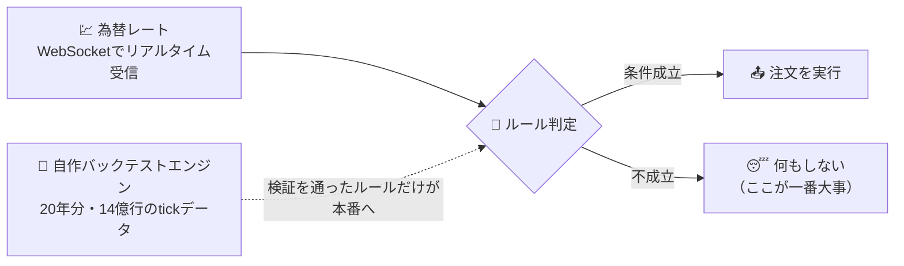
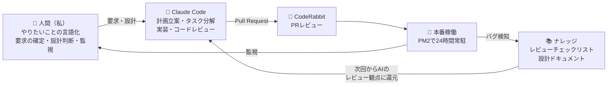

# Luchida — ルール駆動FX自動売買システム

FXで一番難しいのは、相場を読むことではなく「自分で決めたルールを、自分で守ること」でした。ならば意志の強さに頼らず、**意志が介入できない構造**を作ればいい——それが Luchida です。ルールの条件が成立したときだけ取引し、それ以外のときは何もしません。

> **免責事項** 本リポジトリは個人の技術検証を目的としたもので、投資助言・投資勧誘ではありません。FXには元本を失うリスクがあります。収益性を保証・示唆するものではなく、運用成績・損益は一切公開していません。

## 30秒でわかる Luchida

- ルール成立時のみ取引するFX自動売買システム。**要件定義から運用・保守まで「1人 + AI」で実施**
- 売買ルールは自作バックテストエンジンで統計検証してから本番投入
- PM2 で24時間常駐。監視・自動復旧・緊急全決済まで運用設計済み
- 本業は Java / Kotlin。異なるスタックでも全工程を完遂できるかの検証を兼ねた個人プロジェクト

## 技術スタック

**言語・ランタイム**

**バックエンド**

**データ**

**フロントエンド（監視UI）**

**品質・テスト**

**運用・開発プロセス**

## 開発スタイル — AI-DLC

AWS が提唱する **AI-DLC（AI-Driven Development Lifecycle）** を個人開発に適用し、「AIが開発プロセスを主導し、人間が監督する」体制で回しています。

- INCEPTION（要求分析）→ CONSTRUCTION（設計・実装・テスト）→ OPERATIONS のサイクルで進行し、進行状態も文書で管理
- 本番でバグが出たら原因と教訓をナレッジに還元し、次からAIのレビュー観点として効かせる
- AIに任せるには判断基準の言語化が必要。その結果、設計ドキュメント53ファイル・値オブジェクト設計書1,897行が資産として残った

## 中身をちょっとだけ（エンジニア向け）

設計の軸は **DDD（ドメイン駆動設計）× クリーンアーキテクチャ**。ドメインロジックを値オブジェクト中心にモデリングして中核に置き、外部API・DB・UIへの依存は外側のレイヤーに隔離。その境界は人の注意力ではなく、ESLintと構造に守らせています。

- **ポート&アダプタ構成**: domain 層から外側への import はゼロ。ESLint で機械的に強制（[packages/backend/src/](packages/backend/src/)）
- **共有カーネル**: バックテストと本番が同一の domain コードを実行し、「検証したものと動くものが違う」を構造で排除（[packages/backtest/README.md](packages/backtest/README.md)）
- **フェイルセーフ**: サーキットブレーカー、決済失敗の補償キュー、停止時は DB とブローカーの建玉照合（[bin/luchida.sh](bin/luchida.sh)）
- **テスト**: vitest でテストファイル132件。シェルスクリプトにも bats + shellcheck
- **設計ドキュメント**: draw.io 図25点・シーケンス図11本（[docs/design/](docs/design/)）。採用した設計だけでなく「捨てた案と理由」も記録

## 読み方ガイド

- **採用ご担当の方**: ここまでで全体像は伝わっています
- **エンジニアの方**: [project-structure.md](docs/design/overview/project-structure.md) → [value-objects.md](docs/design/value-objects.md) → [packages/backend/src/domain/](packages/backend/src/domain/) の順がおすすめです

## 位置づけ（参画先への申告事項）

- 業務時間外の個人活動です。個人資金のみで検証し、第三者の資金・資産は扱いません
- 所属先・参画先の情報・コードは一切含みません
- 金融商品取引業の登録を要する行為（投資助言・売買システムの販売・シグナル配信等）は行っていません

## このリポジトリについて

非公開リポジトリのスナップショットミラーです（履歴1コミット・Issues / PR なし。開発履歴と意思決定の記録は非公開側で管理）。同期時は公開可能なパスのみをアローリスト方式で抽出し、禁止パターン走査を通しています。

技術ポートフォリオとしての**閲覧のみ**を目的とした公開であり、複製・改変・再配布・実行は許諾していません（[LICENSE](LICENSE)）。
