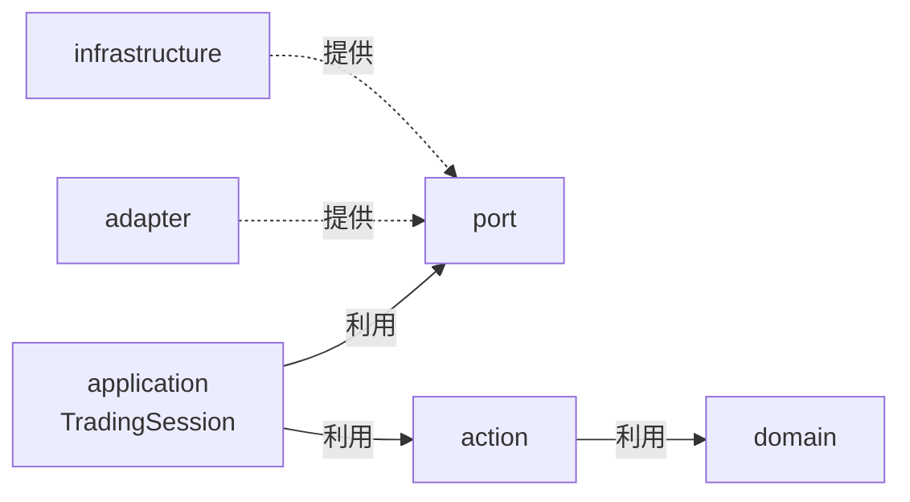

# プロジェクト構造設計

> モノレポ構成。フロントエンド（React）とバックエンド（Node.js 取引エンジン）を1リポジトリで管理する。

---

## 1. 全体構成

```
luchida/
  packages/
    frontend/              ← React UI（シグナル表示、ポジション表示）
    backend/               ← 取引エンジン（Node.js）
  docs/
    design/                ← 設計図（drawio, mermaid md）
  package.json             ← npm workspaces root
```

### なぜ frontend / backend 間で型を共有する shared/ パッケージを作らないのか

※ここでの shared/ は「パッケージ間の共有置き場」の話。`domain/rule/shared/`（戦略非依存の共通ルール部品置き場）とは別物。
- フロントエンドはバックエンドのドメインオブジェクトを直接知らなくてよい。
- WebSocket や REST API 経由でデータを受け取るため、フロントエンドが知るのは「API のレスポンス型」だけで十分。
  - shared/ を作ると domain オブジェクトの「正の定義」がどこにあるか曖昧になり、Clean Architecture の層境界を乱す。
frontend 内で API レスポンス型を定義する。

---

## 2. バックエンド構造

```
packages/backend/
  src/
    domain/          # ビジネスの核心。Rule判定・ローソク足・指標計算。外への依存ゼロ
    action/          # 注文の実行役。Ruleの判定結果を受け取り、実際に注文を出す
    application/     # 段取り役。市場データを受け取り、RuleとActionを組み合わせて全体を回す
    port/            # 外部との約束事。「こういう機能を使いたい」を interface で定義するだけ
    adapter/         # portの約束を実際に果たす。GMO FX APIへの実際の接続処理を担う
    infrastructure/  # 技術的な配管。WebSocket管理・DB接続・ログ出力
  package.json
```

依存の方向（外→内のみ）:



> **矢印の読み方**: `A → B` は「A は B を知っている」。矢印の先（内側）は知られる側。矢印の元（外側）は知る側。
> 外側のコードが内側を知る。内側のコードは外側を一切知らない。これがこの設計の鉄則。

---

## 3. domain 層の詳細

```
domain/
  rule/
    EntryRule.ts           # エントリー判定のインターフェース。市場データを受け取り EntryCommand か DoNothing を返す
    ExitRule.ts            # 決済判定のインターフェース。市場データとポジションを受け取り ExitCommand か DoNothing を返す
    sma-cross/             # SMAクロス戦略の実装
      SmaCrossEntryRule.ts # SMAゴールデンクロス/デッドクロスでエントリー判定
      SmaCrossExitRule.ts  # SMA逆クロスで決済判定
      SmaCrossSignal.ts    # SMAクロスのシグナル検知ロジック
    shared/                # 戦略に依存しない共通ルール部品（固定損切り・利確・時間決済・各種フィルタ）の置き場
      FixedStopLossExitRule.ts # 固定pips損切り
  command/
    EntryCommand.ts        # エントリー命令。通貨ペア・Lot・確信度など注文に必要な情報を持つ
    ExitCommand.ts         # 決済命令。どのポジションを閉じるかを持つ
    DoNothing.ts           # 「今は何もしない」という判定結果。EntryRule・ExitRule 両方が返しうる
    EntryReason.ts         # エントリー理由の値オブジェクト
    ExitReason.ts          # 決済理由の値オブジェクト
  market/
    candle/
      ConfirmedCandle.ts   # 確定済みのローソク足。一度作ったら変わらない
      FormingCandle.ts     # 現在形成中のローソク足。tickが来るたびに更新される
      CandleEvent.ts       # 足が更新された・確定したというイベント
      CandleAccumulator.ts # tickを受け取り、ローソク足を組み立てる
      CandleOpenTime.ts    # 足の開始時刻
      CandleCloseTime.ts   # 足の終了時刻
    tick/
      Tick.ts              # 市場の瞬間価格（買値・売値・時刻）
      TickTimestamp.ts     # tickの時刻
    indicator/
      IndicatorValues.ts   # 確定足・形成中の足それぞれのテクニカル指標をセットで持つ
      SmaSnapshot.ts       # SMAの現在値と一つ前の値。ゴールデンクロス判定に使う
      SmaValue.ts          # SMAの計算結果の値
      IndicatorLedger.ts   # SMAを計算して記録する台帳
      SmaCalculator.ts     # SMA計算のインターフェース
    snapshot/
      MarketSnapshot.ts    # Ruleに渡す「今この瞬間の市場全体の状態」
      TimeFrameSnapshot.ts # 特定の時間足（1分足など）の状態。確定足・形成中足・指標をまとめて持つ
    BuySell.ts             # 売買方向（BUY / SELL）
    Price.ts               # 価格の値
    Pips.ts                # pips値（損益計算に使う）
    Spread.ts              # スプレッド（買値と売値の差）
    CurrencyPair.ts        # 通貨ペア（USD_JPY など）
    TimeFrame.ts           # 時間足の種類。1分足・15分足・1時間足・日足の4種
    TimeFrameBook.ts       # 複数の時間足をまとめて管理する帳簿。tickを渡すと市場状態を返す
    Timestamp.ts           # 時刻の値オブジェクト
    ConvictionScore.ts     # Ruleの確信度（0.0〜1.0）
    EntryResult.ts         # エントリー約定結果（約定価格・ポジションID・時刻）
    ExitResult.ts          # 決済約定結果（約定価格・損益・時刻）
  position/
    Position.ts            # 保有ポジション。どの通貨ペアを何Lot持っているか
    OpenPositions.ts       # 現在保有中のポジション一覧
    PositionId.ts          # ポジションを識別するID
    Lot.ts                 # 取引単位（何Lot買うか）
  error/
    BrokerError.ts         # 注文に関するドメインエラー。Adapterが外部API固有のエラーをこの型に変換する
    MarketDataError.ts     # 市場データ取得に関するドメインエラー。同上
```

### 設計判断の記録

**なぜ market/ を 4 つに分割するのか**
変更理由が異なるものを分ける。RSI 追加時は indicator/ だけ変わる。
GMO API 仕様変更で Tick 構造が変わっても candle/ には波及しない。
1つにまとめると、片方を変えたとき関係ないファイルを巻き込むリスクが生まれる。

**なぜ DoNothing は rule/ ではなく command/ に置くのか**
DoNothing は「何もしない」という判定結果であり、EntryRule・ExitRule 両方が返す。
Ruleインターフェース固有の概念ではなく、Command と並列に位置する結果型。
技術的に「ヌルオブジェクト」だが、ドメイン的には「見送り」という意思決定。

**なぜ TimeFrameBook は market/ 直下なのか**
candle/・tick/・indicator/・snapshot/ の全てを束ねる「帳簿」であり、
特定のサブドメインに属さない。market/ の集約ルート的な位置づけ。

**なぜ rule/ にサブディレクトリを切るのか**
Phase 2 で RSI・乖離・ヒゲの3戦略が追加される。戦略ごとにディレクトリを分けることで、
ある戦略の変更が他の戦略に波及しない。

**なぜ error/ を domain 層に置くのか**
BrokerError・MarketDataError はドメインの言葉で定義されたエラー（「注文が拒否された」「接続が切断された」）。
Adapter 層が外部API固有のエラーをこの型に変換して throw し、application 層がハンドリングする。
GMO固有のエラー（GmoApiError）は adapter/gmo/ にあり、domain には出てこない。

---

## 4. action 層

```
action/
  EntryExecution.ts    # エントリー注文を出す。Ruleの判定結果を受け取り、注文APIを呼ぶだけ
  ExitExecution.ts     # 決済注文を出す。Ruleの判定結果を受け取り、注文APIを呼ぶだけ
```

ここは「判定」をしない。「入るか入らないか」を考えるのはRuleの仕事。
action層はRuleが出した命令を受け取って、実際に注文を出す係。
ここに条件分岐（if文）が増えてきたら、Ruleの仕事が漏れ出している。

---

## 5. application 層

```
application/
  TradingSession.ts    # 全体の段取り役。起動・停止を管理し、各部品を組み合わせて動かす
```

起動時に市場データの受信を始め、データが来るたびにRuleに判定させ、
命令が出たらActionに渡す。全体の流れを束ねる司令塔。
今は1ファイルで十分。将来大きくなったら分割を検討する。

---

## 6. port 層

```
port/
  MarketDataPort.ts        # リアルタイムのtick受信を実装するクラスのインターフェース
  MarketDataStreamPort.ts  # 市場データストリームの開始・停止を実装するクラスのインターフェース
  CandleHistoryPort.ts     # 過去のローソク足取得を実装するクラスのインターフェース
  Broker.ts                # エントリー・決済の発注を実装するクラスのインターフェース
  PositionRepository.ts    # ポジションの保存・取得を実装するクラスのインターフェース
  UiNotifier.ts            # UIへの通知（シグナル状態・決済完了）を実装するクラスのインターフェース
```

インターフェースにすることで、テスト時にスタブに差し替えられる。
また、FX会社やDBを将来変更する際に、このインターフェースを満たす新しいクラスを作るだけで済む。

なぜ `KLinesPort` ではなく `CandleHistoryPort` なのか: KLines は特定FX APIの技術用語。
ここはドメインの言葉を使う場所なので、「過去のローソク足」を意味する CandleHistory にした。

なぜ `MarketDataStreamPort` が必要なのか: TradingSession（application層）が
MarketDataStream（infrastructure層）に直接依存するのを防ぐため。
これがないと application → infrastructure の依存方向違反になる。

---

## 7. adapter 層

```
adapter/
  gmo/                          # FX会社ごとに1フォルダ。将来の乗り換えに備える
    GmoMarketDataAdapter.ts     # MarketDataPort（→ §6）の実装。GMOからtickを受信する
    GmoCandleHistoryAdapter.ts  # CandleHistoryPort（→ §6）の実装。GMOから過去足を取得する
    GmoBrokerAdapter.ts         # Broker（→ §6）の実装。GMOに注文を出す
    GmoWebSocketClient.ts       # WebSocket接続の管理（接続・維持・再接続）
    GmoRestClient.ts            # REST APIの呼び出し共通処理（認証・リクエスト・レスポンス解析）
    GmoApiError.ts              # GMO API固有のエラー型。Adapter内部で使い、外にはBrokerError等に変換して出す
  indicator/                    # テクニカル指標計算の外部ライブラリをラップする
    TradingSignalsSmaCalculator.ts # SmaCalculator（→ §3 indicator/）の実装
```

各 Adapter が満たすインターフェースの定義は [§6. port 層](#6-port-層) を参照。

FX会社ごとにフォルダをまとめているのは、将来ブローカーを変えるとき
`adapter/gmo/` をまるごと差し替えるだけで済むようにするため。
ファイルが散らばっていると、どこまで変えればいいかわからなくなる。

MarketDataStream をこのフォルダに入れないのは、MarketDataStream が特定のFX APIを
知らない汎用の部品だから。FX会社固有のフォルダに置くと誤解を招く。

---

## 8. infrastructure 層

```
infrastructure/
  MarketDataStream.ts              # MarketDataStreamPort（→ §6）の実装。tickを受け取り、TimeFrameBookに渡す中継役
  server/
    ExpressServer.ts               # HTTPサーバー + Socket.IO。UIにAPIを提供する
    SocketIoUiNotifier.ts          # UiNotifier（→ §6）の実装。Socket.IO経由でUIにイベントを送信する
  database/
    schema/                        # Drizzle ORM のテーブル定義ファイル置き場
    connection.ts                  # DBへの接続
    PostgresPositionRepository.ts  # PositionRepository（→ §6）の実装。ポジションのDB保存・取得
  logging/
    Logger.ts                      # ログ出力
```

MarketDataStream がここにあるのは、特定のFX APIを知らない汎用の部品だから。
adapterでもdomainでもない、技術的な配管の役割なのでinfrastructureに置く。

**ExpressServer の既知の問題（Phase 2 Unit ⑥ で修正予定）**
- GmoRestClient（Adapter具象）を直接 import している → Port を介すべき
- 緊急全決済のビジネスロジックを含んでいる → Action 層に分離すべき
- GMO同期で PositionRepository を経由せず直接SQLを実行している → Port 経由に変更すべき

---

## 9. rules/ submodule について（撤回済み）

当初は Rule の実装を別リポ（luchida-rules）で git submodule 管理する計画だった。
リポジトリ自体が private であるため分離の意味が薄く、撤回した。
Rule の実装コードは全て `domain/rule/` 配下に直接置いている。

---

## 10. 技術スタック

| 項目 | 採用技術 | 理由 |
|---|---|---|
| 言語 | TypeScript | 型安全性・エコシステム |
| ランタイム | Node.js v24（Active LTS） | 現行の最新安定版 |
| パッケージマネージャー | npm | シンプル・標準的 |
| テストフレームワーク | Vitest | 新規TSプロジェクトの標準。ESMネイティブ・高速 |
| PostgreSQLクライアント | Drizzle ORM | SQL透明性が高くClean Architectureと相性◎ |
| テクニカル指標 | trading-signals | SMA/ATR/RSI/ADX対応。依存ゼロ・活発にメンテ中 |
| 金融精度演算 | big.js | 小数点以下N桁管理がFX価格に素直 |
| WebSocket / HTTP | Node.js built-in | v24でfetch・WebSocket標準搭載 |
| ガウス関数 | 自前実装 | Math.expとMath.sqrtで10〜20行。外部不要 |

---

## 11. フロントエンド構造（概要）

```
packages/frontend/
  src/
    components/  # React コンポーネント
    api/         # バックエンドとの通信（WebSocket / REST）
    types/       # バックエンドから受け取るデータの型定義
  package.json
```

フロントエンドはバックエンドのコードを直接読み込まない。
WebSocketやREST APIを通じてデータをやり取りし、
受け取るデータの形は `types/` の中でフロントエンド側が独自に定義する。
バックエンドの内部構造が変わっても、APIの形さえ変わらなければフロントは影響を受けない。
