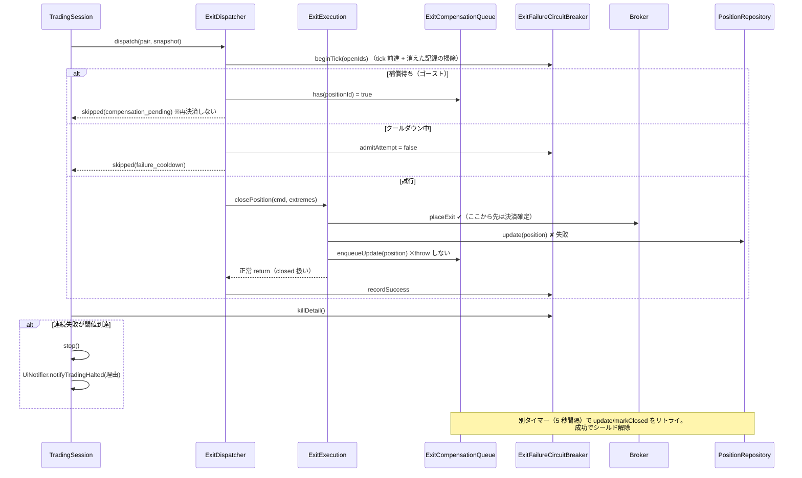

# 決済の部分成功補償と kill-switch（#186）

出典: Issue #186 / step8-brief.md N2。実証事例は 2026-06-11 の本番障害（#287 検証中に発見。
「DB に OPEN・ブローカーに建玉なし」の不整合で決済リトライが約 65 秒間暴走し、レート制限 WARN 19 件）。

## 1. 問題

`ExitExecution.closePosition` は「① broker.placeExit → ② position.close → ③ repository.update」の順で動く。
①が成功し③が失敗すると、**broker 側はクローズ済み・DB は OPEN のまま**（ゴーストポジション）になる。

Step 8 の「次 tick で再評価される契約」はこのケースで裏目に出る:
次 tick でも DB の OPEN を拾い、存在しない建玉へ決済注文を出し、失敗し続ける（毎 tick の発注スパム）。
定期 sync（1 分間隔）が DB を直すまで暴走が続く。

暴走の引き金は認証エラーに限らず「決済が恒久的に失敗する状態」全般。
よって防御はエラー種別に依存させない。

## 2. 構成要素

| 部品 | 層 | 役割 |
| --- | --- | --- |
| `ExitCompensationQueue`（`ExitCompensationQueuePort`） | action / port | 部分成功の記録・DB 反映の非同期リトライ・シールド提供 |
| `ExitFailureCircuitBreaker` + `ExitFailureThreshold` | domain/guard | ポジション別の連続失敗カウント・クールダウン・kill 判定（TradingGuard 原型） |
| `ExitExecution`（改修） | action | broker 成功後の失敗を throw せず補償キューへ |
| `ExitDispatcher`（改修） | application | シールド skip / クールダウン skip / 試行結果の記録 |
| `TradingSession`（改修） | application | dispatch 後に kill 判定を問い、発動時に stop + UI 通知 |
| 起動時 reconciliation | main | 監視開始前に `SyncPositionsUseCase.execute()`（fail-fast） |

前例踏襲: タイマー運用は `EntryQueue`、停止回路は `AuthFailureCircuitBreaker`（#290）、
port 分離は `EntryQueuePort`。

Note（Auth 版との差分）: `AuthFailureCircuitBreaker` は報告口（`AuthFailureReportPort`）と
関門口（`EntryAdmissionPort`）を port として分離するが、Exit 版は具象クラスを直接注入する。
記録（ExitDispatcher）と kill 判定（TradingSession）が同一の失敗集合を見る必要があり口を
分離する意味がないこと、Noop 差し替えが必要な任意依存ではないことが理由。
将来 TradingGuard に統合する際は、この注入点が接合面になる。

## 3. 防御の流れ

## 4. 設計判断

### 4.1 部分成功は「失敗」として返さない

`placeExit` 成功後の `close` / `update` 失敗を throw で返すと、呼び出し側は「決済失敗」と誤解して
再試行する（これがスパムの正体）。決済は broker 側で確定しているので、呼び出し側には成功として返し、
残った DB 反映だけを補償キューに委ねる。

- `update` 失敗 → `enqueueUpdate(CLOSED 遷移済み集約)`: 決済価格・損益を保持したまま補償
- `close` 失敗（ドメイン遷移の不変条件違反）→ `enqueueMarkClosed(id)`: 決済価格・損益は失われるが
  ゴースト解消を優先する縮退経路

**`closedAt` の契約（markClosed 経路）**: `markClosed` で閉じた行の `closedAt` は実際の決済時刻では
なく **DB 反映に成功した時刻**（定期 sync なら同期時刻、補償キューなら補償成功時刻）。
下流（分析基盤・保有時間統計）はこの値を約定時刻として扱ってはならない。縮退行は
`status = 'CLOSED' AND exit_price IS NULL` で識別・除外できる（通常決済フローは必ず
`update(position)` で exit_price を書くため）。broker 約定履歴からの復元
（`PositionRepository.markClosed` の既存 TODO）が根治策。

### 4.2 補償リトライは打ち切らない

Issue 原文には「最大リトライ回数」とあるが、採用しなかった。エントリを落とすとシールドも消えて
発注スパムが再発するうえ、「諦めた後に誰が復旧させるか」の答えがない（無人常駐システムのリトライ設計
3 原則）。代わりに連続失敗 10 回で失敗ログを warn → error に昇格して人間に知らせる。
復旧経路は 3 系統: DB 復旧後の次周期 drain / 定期 sync（1 分間隔）/ 再起動時の startup reconciliation。

### 4.3 バックオフは指数ではなく固定クールダウン

決済再試行の間引きは「失敗 → 30 tick スキップ」の固定幅（シニアレビュー指摘）。指数バックオフより
監視・見積りが単純で、tick 基準なので閑散時間帯に無駄な再試行が密になることもない。

### 4.4 kill-switch の発動条件と閾値の根拠

発動条件は **同一ポジションの連続失敗回数**（エラー種別非依存）。カウントがリセットされるのは
決済成功か、ポジションが OPEN 集合から消えたときだけ。

既定閾値 25 の根拠: クールダウン 30 tick（活況時 ≈ 3 秒）× 25 回 ≈ 75 秒 > 定期 sync 間隔 60 秒。
ゴースト起因の失敗なら定期 sync に最低 1 回の修復機会を与え、それでも直らない失敗だけを
「恒久的」と判定して止める。`EXIT_FAILURE_KILL_SWITCH_THRESHOLD` で変更可。

### 4.5 kill-switch 発動後の世界

- `TradingSession.stop()`: Entry / Exit の評価が止まる。**ポジションは broker 側に残る**
- **トレードオフ（要認識）**: 発動条件はポジション単位だが停止はセッション全体。
  特定ポジションだけが恒久失敗するケース（当該建玉だけ broker が拒否する等）では、
  **健全な他ポジションの SL/TP 監視まで止まる**。全体障害（認証断等）ならどうせ全 Exit が
  失敗するため停止が正しいが、局所障害では過剰停止になる。TradingGuard 本実装で
  「ポジション単位の隔離（quarantine）」と「全体停止」の条件分離を検討する
- 止まらないもの: HTTP サーバー / 定期 sync / 補償キュー / 手動 API（/api/sync・緊急全決済）
- 復旧: 人間が原因解消後に再起動（`luchida -r`）。発動は `event: 'exit_kill_switch_fired'` ログと
  UiNotifier（`trading:halted`）で知らせる。ただし `trading:halted` は emit のため
  発動瞬間に接続中のクライアントにしか届かない。照会可能な停止状態
  （`reportAuthStatus` と同型の `reportTradingStatus`）はフォローアップ Issue で対応する
- 将来: TradingGuard 本実装で自動復帰（認証成功で CLOSED に戻る AuthFailureCircuitBreaker と同型の回復）を検討

### 4.6 補償キューの lifecycle はセッションと切り離す

kill-switch でセッションが止まっても DB 補修は続けるべきなので、start/stop は main が持つ
（`TradingSession.start/stop` に紐付けない）。キューは in-memory で再起動により揮発するため、
main() は監視開始前に必ず `SyncPositionsUseCase.execute()` を 1 回実行する（失敗は fail-fast）。

## 5. 観測イベント一覧

| event | レベル | 意味 |
| --- | --- | --- |
| `exit_partial_success_detected` | error | 部分成功を検出（phase: close / update） |
| `exit_compensation_enqueued` | warn | 補償キューに登録 |
| `exit_compensation_retry_failed` | warn（10 回目から error） | 補償リトライ失敗 |
| `exit_compensation_recovered` | info | ゴースト解消 |
| `exit_compensation_pending_at_shutdown` | warn | 未収束のまま停止（起動時 reconciliation に引き継ぎ） |
| `exit_dispatch_failed` | error | 決済試行失敗（`consecutiveFailures` 付き） |
| `exit_kill_switch_fired` | error | kill-switch 発動（positionId / 回数 / 閾値付き） |
| `startup_position_sync_ok` | info | 起動時 reconciliation 完了 |
