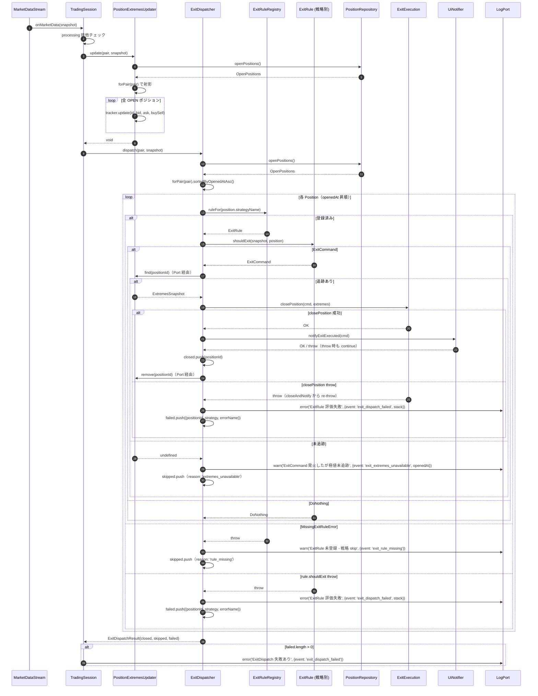

# Step 8 PR B 実装手順書（LLM 向け）

対象: `#51 Step 8 PR B` — `ExitDispatcher` + `PositionExtremesPort` + `PositionExtremesUpdater` の実装
作業ブランチ: `phase8/exit-dispatcher`（`phase8/main` から派生済み）
事前読み込み必須:
- `docs/design/position-manager/step8-brief.md`（v3.1）— **特に 2 章 / 5.1〜5.7 章**
- `packages/backend/src/domain/position/ExtremeTracker.ts`
- `packages/backend/src/application/TradingSession.ts`（5.4 縮退前の現状姿）
- `packages/backend/src/application/PositionManager.ts`（Phase 7 で確立した application 層パターン）
- `packages/backend/src/domain/port/LogPort.ts`
- `packages/backend/src/port/PositionRepository.ts`

---

## ⚠ 前提と禁止事項

- **TradingSession は変更しない**（PR C で対応）
- **main.ts は変更しない**（PR C で対応）
- **既存テストを破壊しない**（PR A 時点で 970 件 PASS、本 PR で増えるだけ）
- `--no-verify` / `--force` 等は使わない
- 各ステップ完了時に `npm run typecheck --workspace=@luchida/backend` を必ず走らせる

## 完了条件（PR B 全体）

1. backend `npm run typecheck` PASS
2. backend `npm test` PASS（PR A の 970 件 + PR B 追加分）
3. 以下のファイルが新規作成され、すべてテスト含む
   - `packages/backend/src/domain/position/ExtremesSnapshot.ts`
   - `packages/backend/src/port/PositionExtremesPort.ts`
   - `packages/backend/src/application/PositionExtremesUpdater.ts` + テスト
   - `packages/backend/src/application/ExitDispatcher.ts` + テスト
   - `docs/design/sequence/core/multi-strategy-exit.md`
4. 以下のファイルが同期更新されている
   - `docs/design/position-manager/policies.md` 2.5 章
   - `docs/design/value-objects.md` の OpenPositions / ExitRuleRegistry / ExitDispatchResult / Port 群
5. **PR B 範囲外として別 Issue 化される項目**（手順書中で明記される）
   - `ExtremesSnapshot` の class 昇格（`ExitExecution` 互換破壊のため。本 PR では interface 維持）
   - `ExtremeTracker` シグネチャを `PositionId` 受け取りに変更（backtest 経路への影響広）
   - Updater と Dispatcher の `openPositions()` 二重取得統合（PR C で TradingSession が共有する形）

---

## Step 1: `ExtremesSnapshot` 型を切り出す

### 目的

`ExtremeTracker` 内 private interface `Extremes` を domain 層の公開 VO に昇格。`PositionExtremesPort` の戻り型として使う。

### 作業

1. `packages/backend/src/domain/position/ExtremesSnapshot.ts` を新規作成

```ts
import type { Price } from '../market/Price.js';

/**
 * 保有期間中の最高値・最安値スナップショット。
 * MFE/MAE 算出（Position.applyExtremes）の入力として使う。
 *
 * Note (記録される Price の意味):
 *   - tick モード（live / ExitDispatcher 経路）: BUY ポジションは bid（売り決済価格）で追跡、SELL ポジションは ask（買い決済価格）で追跡（decisive 価格）。
 *   - OHLC モード（backtest）: 足の high / low を BUY/SELL に依存せず記録（`ExtremeTracker.updateOhlc` 経由）。
 *
 * Note (現状 interface のまま / class 昇格は別 Issue):
 *   既存 `ExitExecution.closePosition` の引数が structural な `{ highest: Price; lowest: Price }`
 *   を受けているため、本 PR B では互換性維持で interface 形を採用する。
 *   VO 三条件（private constructor / equals / static factory）への class 昇格は別 Issue で対応。
 *
 * Note (初回 update 前のアクセス):
 *   `PositionExtremesPort.find` は未追跡時 `undefined` を返す。
 *   呼び出し側（ExitDispatcher）は undefined を「次 tick 再評価」として扱い throw しない。
 */
export interface ExtremesSnapshot {
  readonly highest: Price;
  readonly lowest: Price;
}
```

1. `packages/backend/src/domain/position/ExtremeTracker.ts` の `Extremes` interface を削除し、`ExtremesSnapshot` を import して置換

**Note (interface のままで `VO` ではなく構造的 DTO)**: `ExtremesSnapshot` は `Object.freeze` 等の不変保証や `equals` を持たない単なる `readonly` interface。VO 三条件（private constructor / equals / static factory）は満たさない。これは `ExitExecution.closePosition` 既存実装の structural type 期待に合わせた**妥協であり、VO ではない**。現状実害なく、運用上問題が顕在化した時点で class 昇格を再評価する。


```diff
-interface Extremes {
-  highest: Price;
-  lowest: Price;
-}
+import type { ExtremesSnapshot } from './ExtremesSnapshot.js';
```

```diff
-  private readonly tracking = new Map<string, Extremes>();
+  private readonly tracking = new Map<string, ExtremesSnapshot>();

-  get(positionId: string): Extremes | undefined {
+  get(positionId: string): ExtremesSnapshot | undefined {
```

ほか `Extremes` の参照箇所を `ExtremesSnapshot` に置換（`update` / `updateOhlc` 内のローカル変数も含む）。

### 検証

- `npm run typecheck --workspace=@luchida/backend` PASS
- `npm test --workspace=@luchida/backend` で ExtremeTracker テストが PASS
- `grep -r "from.*ExtremeTracker" packages/` で参照箇所を確認し、型輸入の波及（特に backtest 経路 `Runner.ts` 等）が無いことを確認

### 完了条件

`grep "interface Extremes\b" packages/backend/src` が 0 件、`ExtremesSnapshot` への置換完了。

### コミット粒度（R2 金融-R4 + R3 で 3 コミット化）

**Step 1 / Step 3.5 / Step 2,4-7 の 3 コミット構成**:
1. Step 1: ExtremeTracker の Extremes interface を ExtremesSnapshot に昇格（refactor、振る舞い不変）
2. Step 3.5: ExitDispatchResult.skipped に reason 追加 + 継承切り（refactor、PR A 既存ファイルの API 拡張）
3. Step 2 / Step 4-7: 新規 Port + Updater + Dispatcher + 設計書同期（feat、本体実装）

`git blame` で意図を追いやすく、レビュー時の差分視認性も上がる。Step 9 のコミット手順は後述の 3 コミット構成に従う。

---

## Step 2: `PositionExtremesPort` interface 作成

### 目的

`ExitDispatcher` に注入する Port を定義。既存 `xxxPort` 命名慣習に従う。

### 作業

`packages/backend/src/port/PositionExtremesPort.ts` を新規作成

```ts
import type { PositionId } from '../domain/position/PositionId.js';
import type { ExtremesSnapshot } from '../domain/position/ExtremesSnapshot.js';

/**
 * ポジションの極値追跡へのアクセス Port。
 *
 * 責務:
 * - `find`: 指定 Position の極値スナップショットを取得（決済時の MFE/MAE 算出用）。
 *   未追跡時は `undefined` を返す（throw しない）。Tell-Don't-Ask に近い Optional 返却。
 * - `remove`: 決済済み Position の追跡データを破棄。冪等。
 *
 * 注: 更新責務（`update`）はこの Port には含まれない（`PositionExtremesUpdater` 経由）。
 *     これにより ExitDispatcher は「読み取り + clean up のみ」の最小権限で動作する。
 *
 * Note (Reader/Writer 分離 / 依存方向):
 *   Port interface は `port/` 層、実装側 `PositionExtremesUpdater` は `application/` 層。
 *   ExitDispatcher は本 interface のみに依存し、具象 Updater を知らない。
 *   Clean Architecture: application 層 → port 層 の正方向依存。
 *
 * Note (Ask 派寄りの暫定設計):
 *   Optional 返却は throw 契約の Tell 派にも完全な Ask 派にも寄っていない暫定形。
 *   Tell-Don't-Ask 化（`findOrSkip(positionId, onSkip): void` 等）は現状不要と判断（Optional 返却で十分 observable）。
 *
 * 設計書: docs/design/position-manager/step8-brief.md 5.3 / step8-pr-b-impl-plan.md。
 */
export interface PositionExtremesPort {
  /**
   * 指定 Position の極値スナップショットを返す。
   * 未追跡時（update が一度も走っていない / すでに remove 済み）は `undefined` を返す。
   * 呼び出し側は undefined を「次 tick 再評価」または「決済延期」として扱う。
   */
  find(positionId: PositionId): ExtremesSnapshot | undefined;

  /** 指定 Position の追跡データを破棄する。冪等（存在しなければ no-op）。 */
  remove(positionId: PositionId): void;
}
```

**ラウンド 1 で変更**: 当初 `get(positionId): ExtremesSnapshot`（throw 契約）だったが、レビュー指摘により以下の理由で `find(positionId): ExtremesSnapshot | undefined` に変更:

- **金融-M2**: Updater と Dispatcher が独立に `openPositions()` を読む構造で、その間に状態が変わると update 漏れ → 決済漏れリスク。`find` で undefined を返せば「次 tick 再評価」として観測可能（fail-fast の throw より運用上安全）。
- **DDD-M1**: throw 契約は「順序契約違反」をインフラ的に表現し Port 層の責務を逸脱。Optional 返却が DDD 的に純度高い。

### 検証

- `npm run typecheck --workspace=@luchida/backend` PASS

### 完了条件

interface ファイルが配置され、コンパイル通過。

---

## Step 3: `PositionExtremesUpdater` 実装

### 目的

`PositionExtremesPort` を実装し、加えて `update` で全 OPEN ポジションの極値追跡を進める。

### 作業

`packages/backend/src/application/PositionExtremesUpdater.ts` を新規作成

```ts
import { ExtremeTracker } from '../domain/position/ExtremeTracker.js';
import type { ExtremesSnapshot } from '../domain/position/ExtremesSnapshot.js';
import type { PositionId } from '../domain/position/PositionId.js';
import type { PositionExtremesPort } from '../port/PositionExtremesPort.js';
import type { PositionRepository } from '../port/PositionRepository.js';
import type { CurrencyPair } from '../domain/market/CurrencyPair.js';
import type { MarketSnapshot } from '../domain/market/snapshot/MarketSnapshot.js';

/**
 * 全 OPEN ポジションの極値追跡を進める application service。
 * `PositionExtremesPort` を実装し、`ExitDispatcher` には Port として注入される。
 *
 * 責務:
 * - `update(pair, snapshot)`: 指定 pair の全 OPEN Position に対して極値更新（毎 tick）
 * - `find(positionId)`: 極値スナップショット取得（Port 実装 / 未追跡時は undefined）
 * - `remove(positionId)`: 追跡データ破棄（Port 実装 / 冪等）
 *
 * Note (PositionId の値オブジェクト境界 / 別 Issue 化):
 *   ExtremeTracker は内部で Map<string, ...> を持っており、現状 `.toString()` で文字列化して渡している。
 *   理想は ExtremeTracker のシグネチャを `PositionId` 直受けに変更することだが、
 *   backtest 経路（`updateOhlc` の呼び出し元）への影響が広いため、別 Issue で対応。
 *
 * Note (二重 openPositions 取得 / PR C で統合):
 *   現状 Updater.update と ExitDispatcher.dispatch が独立に `openPositions()` を呼ぶ。
 *   両者の間で状態が変わると update 漏れ → ExitDispatcher で `find` が undefined を返し、
 *   `event: 'exit_extremes_unavailable'` warn ログ + 当該 Position は次 tick に再評価。
 *   PR C で TradingSession が 1 度 `openPositions()` を読んで両者に渡す形に統合予定。
 *
 * 設計書: docs/design/position-manager/step8-brief.md 5.3 / step8-pr-b-impl-plan.md。
 */
export class PositionExtremesUpdater implements PositionExtremesPort {
  constructor(
    private readonly positionRepository: PositionRepository,
    private readonly tracker: ExtremeTracker = new ExtremeTracker(),
  ) {}

  async update(pair: CurrencyPair, snapshot: MarketSnapshot): Promise<void> {
    const forPair = (await this.positionRepository.openPositions()).forPair(pair);
    for (const position of forPair) {
      this.tracker.update(
        position.id.toString(),  // PositionId → string 変換は別 Issue で解消
        snapshot.tick.bid(),
        snapshot.tick.ask(),
        position.buySell,
      );
    }
  }

  /** 未追跡時は `undefined` を返す（throw しない / Port 契約）。 */
  find(positionId: PositionId): ExtremesSnapshot | undefined {
    return this.tracker.get(positionId.toString());
  }

  remove(positionId: PositionId): void {
    this.tracker.remove(positionId.toString());
  }
}
```

### テストファイル

`packages/backend/src/application/PositionExtremesUpdater.test.ts` を新規作成

#### テスト観点

1. **lazy 追跡開始**: 初回 `update` で内部に Position が登録され、`find` で `ExtremesSnapshot` が取れる
2. **pair-bound**: 引数 pair 以外の Position は `update` 対象に入らない（他 pair の Position に対して `find` は `undefined`）
3. **更新の連続**: 同 Position に複数回 `update` すると highest/lowest が累積更新される（BUY なら bid で更新）
4. **`find` の undefined**: 一度も `update` されていない Position に対して `find` は `undefined` を返す（同期メソッドなので `.rejects.toThrow` ではなく素の戻り値検証）
5. **`find` の成功**: update 済み Position は `ExtremesSnapshot`（{ highest, lowest } 両方 `Price` 型）を返す
6. **`remove` 後の `find`**: 削除後の `find` は `undefined`（追跡データ破棄）
7. **`remove` の冪等性**: 存在しない Position の `remove` は throw しない（同 ID への 2 回呼びも OK）

#### Mock の作り方

- `PositionRepository` は `mockPositionRepository(openPositions: OpenPositions)` 形のヘルパで mock（既存 `PositionManager.test.ts` の慣習）
- `MarketSnapshot` は既存テストの fixture を参照
- `makePosition` ヘルパは `OpenPositions.test.ts` のものを参照（必要なら本 PR 内で抽出）

### 検証

- `npm run typecheck --workspace=@luchida/backend` PASS
- `PositionExtremesUpdater.test.ts` 全 PASS

### 完了条件

Updater が `PositionExtremesPort` を実装し、テスト 7 件 PASS。

---

## Step 3.5: `ExitDispatchResult` 拡張（PR A 既存ファイルの破壊的変更）

### 目的

PR A で確定した `ExitDispatchResult` の `ExitDispatchSkipEntry` interface に `reason` フィールドを追加し、`ExitDispatchFailEntry` の継承を切る。Step 4 着手前にこの型変更を完了させ、**独立コミット**として記録する。

### 作業

1. `packages/backend/src/domain/exit/ExitDispatchResult.ts` を編集

```ts
// 変更前（PR A 時点）
export interface ExitDispatchSkipEntry {
  readonly positionId: PositionId;
  readonly strategy: StrategyName;
}

export interface ExitDispatchFailEntry extends ExitDispatchSkipEntry {
  readonly errorName: string;
}

// 変更後
export interface ExitDispatchSkipEntry {
  readonly positionId: PositionId;
  readonly strategy: StrategyName;
  readonly reason: 'rule_missing' | 'extremes_unavailable';
}

export interface ExitDispatchFailEntry {
  readonly positionId: PositionId;
  readonly strategy: StrategyName;
  readonly errorName: string;
}
```

**Note (`SkipReason` を string literal union で確定)**: ドメイン語彙としては `SkipReason.ruleMissing()` 等への VO 化が筋（DDD-M1）。ただし string literal union でも型安全性は確保され、`hasPermanentSkip()` 等のクエリ API は `ExitDispatchResult` 側で吸収できるため、本 PR で string literal union で確定（運用上問題が顕在化した時点で再評価）。

1. `packages/backend/src/domain/exit/ExitDispatchResult.test.ts` を編集
   - 既存テストの `skipped: []` は空配列なので影響なし
   - **新規テスト +2 件追加**:
     - `reason: 'rule_missing'` の skipped エントリを正しく格納できる
     - `reason: 'extremes_unavailable'` の skipped エントリを正しく格納できる
   - 既存 failed エントリのテストは継承切り後も同じ構造（`{positionId, strategy, errorName}`）で通る

### 検証

```bash
npm run typecheck --workspace=@luchida/backend
npm test --workspace=@luchida/backend  # ExitDispatchResult.test.ts PASS
```

### 完了条件

- ExitDispatchResult interface 拡張完了
- 既存テスト + 新規テスト PASS
- このステップ単独で **独立コミット**（コミットメッセージ: `refactor: ExitDispatchResult.skipped に reason 追加 + 継承切り (#51 Step8 PR B)`）

---

## Step 4: `ExitDispatcher` 実装

### 目的

戦略別 ExitRule ディスパッチの本体。pair-bound + stateless + 例外境界確立。

### 作業

`packages/backend/src/application/ExitDispatcher.ts` を新規作成。**brief 5.2 のコードをベースに、ラウンド 1 修正（Port API `find` 化 / ログ event 統一 / extremes 取得位置）を反映**。

#### Constructor 引数順序（固定）

```ts
constructor(
  private readonly registry: ExitRuleRegistry,
  private readonly positionRepository: PositionRepository,
  private readonly exitExecution: ExitExecution,
  private readonly uiNotifier: UiNotifier,
  private readonly extremesPort: PositionExtremesPort,
  private readonly logger: LogPort,
) {}
```

これ以外の順序にしない（テスト fixture / DI 配線の参照位置が壊れる）。

### 着手前確認

- `Step 3.5` が完了している（`ExitDispatchSkipEntry.reason` フィールド存在）
- `StrategyName` が **class（VO）** として export されている（`packages/backend/src/domain/rule/StrategyName.ts` 確認）。`toBeInstanceOf(StrategyName)` がテストで成立する前提
- `MarketSnapshot` の正確な import パスを確認（`find packages/backend/src -name 'MarketSnapshot.ts'`）

#### 参考 import（実装側 = ExitDispatcher.ts）

```ts
import { ExitCommand } from '../domain/command/ExitCommand.js';
import { ExitDispatchResult } from '../domain/exit/ExitDispatchResult.js';
import { MissingExitRuleError } from '../domain/error/MissingExitRuleError.js';  // 値: instanceof で narrowing
import type { ExitExecution } from '../action/ExitExecution.js';
import type { ExitRule } from '../domain/rule/ExitRule.js';
import type { ExitRuleRegistry } from '../domain/rule/ExitRuleRegistry.js';
import type { ExtremesSnapshot } from '../domain/position/ExtremesSnapshot.js';
import type { Position } from '../domain/position/Position.js';
import type { PositionId } from '../domain/position/PositionId.js';
import type { PositionRepository } from '../port/PositionRepository.js';
import type { PositionExtremesPort } from '../port/PositionExtremesPort.js';
import type { UiNotifier } from '../port/UiNotifier.js';
import type { LogPort } from '../domain/port/LogPort.js';
import type { StrategyName } from '../domain/rule/StrategyName.js';  // type のみで足りる（コンストラクタ参照不要）
import type { CurrencyPair } from '../domain/market/CurrencyPair.js';
import type { MarketSnapshot } from '../domain/market/snapshot/MarketSnapshot.js';
```

**Note**: 実装側で `StrategyNameValue` は未使用（`failed`/`skipped` 配列は `StrategyName` VO 直保持）。誤って `StrategyNameValue` を import すると `noUnusedLocals` で typecheck NG。

#### 参考 import（テスト側 = ExitDispatcher.test.ts）

```ts
import { describe, it, expect, vi, beforeEach } from 'vitest';
import { ExitDispatcher } from './ExitDispatcher.js';
import { DoNothing } from '../domain/command/DoNothing.js';  // 値: mockExitRule(DoNothing.instance) 用
import { ExitCommand } from '../domain/command/ExitCommand.js';
import { StrategyName } from '../domain/rule/StrategyName.js';  // 値: expect(...).toBeInstanceOf(StrategyName) で使う
import { Price } from '../domain/market/Price.js';  // 値: defaultSnapshot fixture で使う
import type { ExitRule } from '../domain/rule/ExitRule.js';
import type { ExtremesSnapshot } from '../domain/position/ExtremesSnapshot.js';
import type { LogPort } from '../domain/port/LogPort.js';
import type { PositionExtremesPort } from '../port/PositionExtremesPort.js';
```

#### ExitRule.shouldExit 同期契約

`ExitRule.shouldExit` は **同期** で `ExitCommand | DoNothing` を返す。`dispatch` 内では `await` 無しで結果を受け、`result instanceof ExitCommand` で narrowing する。非同期 throw は契約外（rule.shouldExit が Promise を返したり throw が遅延発生したりすることは想定しない）。

#### OpenPositions 拡張メソッドの戻り型

- `OpenPositions.forPair(pair: CurrencyPair): OpenPositions` — 自己同型
- `OpenPositions.sortedByOpenedAtAsc(): OpenPositions` — 自己同型（`for...of` で反復可能）

よって `(await this.positionRepository.openPositions()).forPair(pair).sortedByOpenedAtAsc()` の戻り型は `OpenPositions`。`for (const position of ordered)` は `Symbol.iterator` で位置順に列挙される（OpenPositions が PR A で `Iterable<Position>` を実装済み）。

### dispatch メソッド スケッチ

```ts
async dispatch(pair: CurrencyPair, snapshot: MarketSnapshot): Promise<ExitDispatchResult> {
  const ordered = (await this.positionRepository.openPositions())
    .forPair(pair)
    .sortedByOpenedAtAsc();

  const closed: PositionId[] = [];
  const skipped: Array<{
    positionId: PositionId;
    strategy: StrategyName;
    reason: 'rule_missing' | 'extremes_unavailable';
  }> = [];
  const failed: Array<{ positionId: PositionId; strategy: StrategyName; errorName: string }> = [];

  for (const position of ordered) {
    let rule: ExitRule;
    try {
      rule = this.registry.ruleFor(position.strategyName);
    } catch (err) {
      // MissingExitRuleError のみ捕捉、それ以外は再 throw（想定外障害の隠蔽防止）
      if (!(err instanceof MissingExitRuleError)) throw err;
      this.logger.warn('ExitRule 未登録 - 戦略 skip', {
        event: 'exit_rule_missing',
        strategy: position.strategyName.value,
        positionId: position.id.toString(),
      });
      skipped.push({
        positionId: position.id,
        strategy: position.strategyName,
        reason: 'rule_missing',  // 恒久的: 運用が register するまで永続 skip
      });
      continue;
    }

    try {
      const result = rule.shouldExit(snapshot, position);
      if (result instanceof ExitCommand) {
        const extremes = this.extremesPort.find(position.id);
        if (!extremes) {
          // update 未実行 = Updater / Dispatcher の openPositions 二重取得で発生し得る
          // 当該 Position は次 tick で再評価する（一時的状態）
          this.logger.warn('ExitCommand 発火したが極値未追跡 - 次 tick 再評価', {
            event: 'exit_extremes_unavailable',
            strategy: position.strategyName.value,
            positionId: position.id.toString(),
            openedAt: position.openedAt.toString(),  // 永続 skip 検知用（同 positionId が古い openedAt で連続出ていたら異常 / 金融-M2）
          });
          skipped.push({
            positionId: position.id,
            strategy: position.strategyName,
            reason: 'extremes_unavailable',  // 一時的: 次 tick の Updater.update で解消
          });
          continue;
        }
        await this.closeAndNotify(result, position, extremes);
        // closeAndNotify が throw しなかった = 決済確定（通知 throw は中で吸収）
        closed.push(position.id);
        this.extremesPort.remove(position.id);
      }
      // DoNothing の場合は何もしない（closed/skipped/failed のいずれにも積まない）
    } catch (err) {
      // closePosition の throw が closeAndNotify を経由して再 throw されてここに来るパス含む
      // 業務ルール: 当該 Position は本 tick では決済失敗とマーク。次 tick で Updater.update が
      // 極値を上書きしたうえで再評価される（部分成功シナリオは #186 補償リトライで対応）
      this.logger.error('ExitRule 評価失敗 - 当該戦略を skip', {
        event: 'exit_dispatch_failed',
        strategy: position.strategyName.value,
        positionId: position.id.toString(),
        error: String(err),
        stack: err instanceof Error ? err.stack : undefined,  // broker 層 / DB 層 / Rule 評価層の区別に必要
      });
      failed.push({
        positionId: position.id,
        strategy: position.strategyName,
        errorName: err instanceof Error ? err.name : 'Unknown',
      });
    }
  }
  return ExitDispatchResult.of({ closed, skipped, failed });
}
```

### closeAndNotify メソッド スケッチ

```ts
private async closeAndNotify(
  cmd: ExitCommand,
  position: Position,
  extremes: ExtremesSnapshot,
): Promise<void> {
  // closePosition 失敗時は **ログを出さずに re-throw**。
  // 上位 dispatch の catch で 1 箇所だけ exit_dispatch_failed ログを出し、ログ重複を防ぐ。
  await this.exitExecution.closePosition(cmd, extremes);

  try {
    await this.uiNotifier.notifyExitExecuted(cmd);
  } catch (err) {
    this.logger.error('決済通知失敗', {
      event: 'exit_notify_failed',
      positionId: position.id.toString(),
      error: String(err),
    });
    // 決済確定済みなので throw しない（呼び出し側で closed.push + extremesPort.remove が走る）。
    // 通知失敗 = ユーザーから見えない決済になるため、別経路アラート（Slack 等）は別 Issue で対応。
  }
}
```

### ログキー規約

| 状況 | level | message | event field | errorName |
|---|---|---|---|---|
| `MissingExitRuleError` 捕捉 | warn | `ExitRule 未登録 - 戦略 skip` | `exit_rule_missing` | -（skipped） |
| `find` が undefined | warn | `ExitCommand 発火したが極値未追跡 - 次 tick 再評価` | `exit_extremes_unavailable` | -（skipped） |
| `rule.shouldExit` / `closePosition` throw（統合） | error | `ExitRule 評価失敗 - 当該戦略を skip` | `exit_dispatch_failed` | `err.name` が failed に入る |
| `uiNotifier.notifyExitExecuted` throw | error | `決済通知失敗` | `exit_notify_failed` | -（決済確定済 → closed に積む） |

**ログ重複防止**: `exitExecution.closePosition` の throw は `closeAndNotify` 内ではログを出さず再 throw のみ。**上位 `dispatch` の catch で 1 箇所だけ `exit_dispatch_failed` ログを出す**（金融-R1 反映 / R1 段階の二重ログを統合）。

全ログに `strategy: position.strategyName.value` と `positionId: position.id.toString()` を含める（既存テスト `expect.objectContaining({ strategy: 'SMA_CROSS' })` 整合）。**`strategy` フィールドの値は `.value`（プリミティブ）でよい**:
- 理由: ログはドメイン層を出た外側 = DTO 境界
- **ただしこの降格はログ層のみ**。`ExitDispatchResult` 内の `skipped[i].strategy` / `failed[i].strategy` は **`StrategyName` VO のまま**（プリミティブ降格しない）

### closePosition throw 時の extremesPort 状態（金融-M3）

- `closePosition` が throw した場合、上位 `dispatch` の catch で `failed.push` される
- `extremesPort.remove` は呼ばれない（成功時のみ）
- 該当 Position は **次 tick で `Updater.update` が走り** highest/lowest が上書きされる
- これにより部分成功（broker 成功 + DB 不整合）シナリオ（#186 補償リトライ対象）でも extremesPort が古い値を保持し続けることはない

### テストファイル

`packages/backend/src/application/ExitDispatcher.test.ts` を新規作成

#### テスト観点

| # | 観点 | 期待 |
|---|---|---|
| 1 | **pair-bound** | 他 pair の Position は評価されない |
| 2 | **戦略別 lookup** | 戦略 A の position は 戦略 A の rule のみが評価される |
| 3 | **`MissingExitRuleError` 捕捉** | `warn + skipped` 記録（`reason: 'rule_missing'`）、他 Position の評価継続 |
| 4 | **`MissingExitRuleError` 以外 throw 透過** | `expect(dispatcher.dispatch(...)).rejects.toThrow()` で全体 throw 確認 |
| 5 | **`rule.shouldExit` throw** | `error + failed` 記録、他 Position の評価継続、`exit_dispatch_failed` ログ |
| 6 | **`closePosition` throw** | `error + failed` 記録、`uiNotifier` 呼ばれない、`extremesPort.remove` 呼ばれない、`exit_dispatch_failed` ログが **1 回のみ**（重複なし） |
| 7 | **`notifyExitExecuted` throw** | `exit_notify_failed` ログ、`closed` に積まれる、**`extremesPort.remove` も呼ばれる**（`toHaveBeenCalledTimes(1)` で固定）|
| 8 | **評価順** | `openedAt` 昇順、同時刻は `PositionId.compareTo` 順 |
| 9 | **`closed` 後 `extremesPort.remove`** | ExitCommand 発火 + 決済成功時、対応する positionId で remove が呼ばれる |
| 10 | **`find` が undefined** | `warn + skipped` 記録（`reason: 'extremes_unavailable'`）、`closePosition` 呼ばれない、**`extremesPort.remove` も呼ばれない** |
| 11 | **`DoNothing` 返却** | `closePosition` 呼ばれない、`closed/skipped/failed` のいずれにも積まれない |
| 12 | **`ExitDispatchResult` 集計** | `closed/skipped/failed` の件数と中身が正しい |
| 13 | **VO 整合（プリミティブ降格回帰防止）** | `expect(result.failed[i].strategy).toBeInstanceOf(StrategyName)` / `result.skipped[i].strategy` も同様 |
| 14 | **非 Error throw** | `rule.shouldExit` が文字列等を throw した場合、`failed[i].errorName === 'Unknown'` |
| 15 | **生 Error throw** | `throw new Error('msg')` 時は `failed[i].errorName === 'Error'`（サブクラス推奨だが許容）|
| 16 | **`remove` の冪等性** | 同 positionId への `remove` を 2 回呼んでも throw しない（Port 契約） |
| 17 | **`skipped.reason` フィールド** | `rule_missing` / `extremes_unavailable` の値が正しく入る |

#### Mock の組み立て

既存 `TradingSession.test.ts` の慣習（factory 関数 + 型注釈）に揃える:

```ts
// fixture
const defaultSnapshot: ExtremesSnapshot = {
  highest: Price.of('150.100'),
  lowest: Price.of('149.900'),
};

// mock factories（既存 TradingSession.test.ts 慣習に揃える）
const mockExitRule = (result: ExitCommand | DoNothing): ExitRule => ({
  shouldExit: vi.fn().mockReturnValue(result),
});

const mockPositionExtremesPort = (
  snapshot: ExtremesSnapshot | undefined = defaultSnapshot,
): PositionExtremesPort => ({
  find: vi.fn().mockReturnValue(snapshot),
  remove: vi.fn(),
});

const mockLogger = (): LogPort => ({
  debug: vi.fn(),
  info: vi.fn(),
  warn: vi.fn(),
  error: vi.fn(),
});
```

**Note**: `mockExitRuleForStrategy` ヘルパは削除した（`_name` 引数未使用 + `mockExitRule` 単独で表現可能 / R3 TS-R1）。戦略別の Rule 配線は `ExitRuleRegistry.of([[StrategyName.SMA_CROSS, mockExitRule(...)], [StrategyName.RSI_REVERSAL, mockExitRule(...)]])` で行う。

`mockPositionRepository(openPositions: OpenPositions)` は既存 `PositionManager.test.ts` のヘルパ流用。

#### dispatch メソッド凝集について（DDD-M3）

dispatch 内ループ本体は約 60 行・約 8 関心（Repository 読取・rule lookup・error catch・extremes 取得・undefined 分岐・rule 評価・closeAndNotify・catch 集計）。実装時に **`evaluatePosition(position, snapshot): Promise<EvaluationOutcome>`** に切り出すか検討する。

```ts
type EvaluationOutcome =
  | { kind: 'close'; extremes: ExtremesSnapshot }
  | { kind: 'skip'; reason: 'rule_missing' | 'extremes_unavailable' }
  | { kind: 'noop' }
  | { kind: 'failed'; errorName: string };
```

**Note (`EvaluationOutcome` は VO ではなく内部 ADT)**: `EvaluationOutcome` は ExitDispatcher 内ループ 1 回分の **中間状態** を表す。外部に漏れない（漏れたら ExitDispatchResult の責務逸脱）ので、VO 三条件（private constructor / equals / static factory）は要求しない。ドメイン層に出さず application 内 private 型として扱う。

本手順書では「単一メソッドのスケッチ」で記載。dispatch は約 60 行で単一メソッドの上限内に収まっており可読性問題なし。`evaluatePosition` 切り出しは現状不要と判断。

### 検証

- `npm run typecheck --workspace=@luchida/backend` PASS
- `ExitDispatcher.test.ts` 全 PASS

### 完了条件

ExitDispatcher が動作し、テスト **17 件** PASS。

### `exit_dispatch_failed` 重複なし assertion 例（観点 #6）

```ts
const errorCalls = (logger.error as ReturnType<typeof vi.fn>).mock.calls.filter(
  ([_msg, ctx]) => (ctx as { event?: string })?.event === 'exit_dispatch_failed',
);
expect(errorCalls).toHaveLength(1);
```

単純な `logger.error.toHaveBeenCalledTimes(1)` は `exit_notify_failed` 等の他 event も含まれるためズレる。**event field で絞り込んでから件数アサート**する。

---

## Step 5: `multi-strategy-exit.md` シーケンス図 新規作成

### 目的

複数戦略の Exit 評価フローを可視化。PR C で `TradingSession.onMarketData` の流れを実装する根拠書になる。

### 作業

`docs/design/sequence/core/multi-strategy-exit.md` を新規作成。Mermaid シーケンス図。

#### 含めるべき要素



**Note**: Updater と Dispatcher が独立に `openPositions()` を呼ぶ 2 重読みは PR C で TradingSession 側に集約予定（Updater.update と Dispatcher.dispatch が同一 OpenPositions snapshot を共有する形）。本 PR B では `find` が `undefined` を返すケースで「次 tick 再評価」として観測可能にする。

加えて以下のセクションを記述:
- **目的**（戦略別ディスパッチで `(pair, strategy_name)` 独立決済を成立させる）
- **登場人物**（各クラスの責務 1 行）
- **例外境界の表**（brief 5.7 の表をコピー）
- **関連設計書リンク**（brief.md / policies.md 2.5 / value-objects.md）

### 検証

- Markdown lint 警告ゼロ（`MD022`：見出し前後空行を必ず空ける）
- Mermaid syntax が VSCode / GitHub Preview でレンダリングできる

### 完了条件

ファイルが配置され、`ExitDispatcher` 名前を含めて全体フローが追える。

---

## Step 6: `policies.md` 2.5 同期

### 目的

PR A 時点では brief.md のみが新設計を反映。PR B で `ExitDispatcher` クラス名 / API が確定したので `policies.md 2.5` を実装に同期する。

### 作業

`docs/design/position-manager/policies.md` 2.5 セクション（`### 2.5 ExitRule 評価ループの変更`）を更新:

1. 「新: 戦略別 lookup（N-C1 準拠）」のサンプルコード（既存 L765-805）を **`ExitDispatcher` のコードに差し替え**
   - `TradingSession 内` 直書きから `ExitDispatcher.dispatch` 形式へ
   - `Map<StrategyNameValue, ExitRule>` 直保持を `ExitRuleRegistry` に変更
   - `position.strategyName.value` ベースの lookup を `registry.ruleFor(strategy)` + `MissingExitRuleError` 捕捉に変更
2. DI 側のサンプル（既存 L800-805）を **`ExitRuleRegistry.of([[...]])` に変更**
3. Note セクションを更新:
   - 「Map キーは `StrategyNameValue` 直保持」→「`ExitRuleRegistry` 内で `StrategyNameValue` に正規化」
   - `MissingExitRuleError` 限定 catch（広い catch でない理由）を 1 段落で追加
4. 参照リンクを `step8-brief.md` / `multi-strategy-exit.md` に追加

### 検証

- 既存 brief.md 5.2 と矛盾しない（`ruleFor` / `notRegistered` / `errorName` などの命名統一）
- Markdown lint PASS

### 完了条件

policies.md 2.5 が PR B 実装と整合し、参照リンク先が存在する。

---

## Step 7: `value-objects.md` 同期

### 目的

PR A / PR B で追加した VO と Port を `value-objects.md` に追記。

### 作業

以下のセクションを追加（既存の OpenPositions / Ratio などの並びに従う）:

- **`OpenPositions` 拡張 API**: `sortedByOpenedAtAsc` / `forPair` / `heldStrategyNames` の 3 メソッドを追記（戻り値、不変条件、用途）
- **`PositionId.compareTo`**: 二次キー用途、全順序性、決定論性
- **`ExitRuleRegistry`**: ファーストクラスコレクション、`of`（タプル配列入力）/ `ruleFor`（throw 契約）/ `has` / `registeredStrategies`
- **`MissingExitRuleError`**: 動詞句 factory `notRegistered(strategy)`
- **`ExitDispatchResult`**: バッチ集計 VO、`closed: PositionId[]` / `skipped: {positionId, strategy, reason: 'rule_missing' \| 'extremes_unavailable'}[]` / `failed: {positionId, strategy, errorName}[]` + `hasFailure()` / `hasPermanentSkip()` クエリ API
- **`ExtremesSnapshot`**: `Extremes` interface から昇格
- **`PositionExtremesPort`** (Reader): `find(positionId): ExtremesSnapshot | undefined` + `remove(positionId): void`
- **`PositionExtremesWriter`** (Writer): `update(pair, snapshot): Promise<void>` — ISP/CQS で Reader と分離（PR C レビューで実装に追加）
- `PositionExtremesUpdater` は両 interface を implements する単一クラス

#### 各セクションのフォーマット

既存 `value-objects.md` で OpenPositions 等のセクションを参照し、同じ階層（## or ###）、同じ項目（責務 / 公開 API / 不変条件 / サンプル / 等価性）を踏襲する。

### 検証

- Markdown lint PASS
- brief.md と命名が完全一致

### 完了条件

value-objects.md に PR A / PR B 追加分が反映されている。

---

## Step 8: 通しの typecheck + test

### 作業

```bash
npm run typecheck --workspace=@luchida/backend
npm test --workspace=@luchida/backend
```

### 完了条件

- typecheck PASS
- 全テスト PASS（PR A の 970 件 + PR B 追加分）
- 増加件数の目安: 既存件数 + `ExitDispatchResult.test.ts` 拡張 + `PositionExtremesUpdater.test.ts` + `ExitDispatcher.test.ts` + レビュー反映追加分を含め **1000 件前後**（PR A 970 + PR B 新規 30 件）

---

## Step 9: コミット + push

### 作業

**3 コミット構成**（R2 金融-R4 + R3 でさらに分離）:

#### コミット 1: Step 1（ExtremeTracker の型 rename のみ、振る舞い不変）

```bash
git add \
  packages/backend/src/domain/position/ExtremesSnapshot.ts \
  packages/backend/src/domain/position/ExtremeTracker.ts

git commit -m "refactor: Extremes interface を ExtremesSnapshot に昇格 (#51 Step8 PR B)

ExtremeTracker 内 private interface Extremes を domain 層公開の
ExtremesSnapshot interface に切り出し。
振る舞い変更なし。class 昇格（VO 三条件）は別 Issue で対応予定。"
```

#### コミット 2: Step 3.5（ExitDispatchResult 拡張）

```bash
git add \
  packages/backend/src/domain/exit/ExitDispatchResult.ts \
  packages/backend/src/domain/exit/ExitDispatchResult.test.ts

git commit -m "refactor: ExitDispatchResult.skipped に reason 追加 + 継承切り (#51 Step8 PR B)

- ExitDispatchSkipEntry に reason: 'rule_missing' | 'extremes_unavailable' 追加
- ExitDispatchFailEntry を ExitDispatchSkipEntry から継承切り
- SkipReason は string literal union で確定（VO 化は現状不要）"
```

#### コミット 3: Step 2 / 4-7（新規追加 + 設計書同期）

```bash
git add \
  packages/backend/src/port/PositionExtremesPort.ts \
  packages/backend/src/application/PositionExtremesUpdater.ts \
  packages/backend/src/application/PositionExtremesUpdater.test.ts \
  packages/backend/src/application/ExitDispatcher.ts \
  packages/backend/src/application/ExitDispatcher.test.ts \
  docs/design/sequence/core/multi-strategy-exit.md \
  docs/design/position-manager/policies.md \
  docs/design/value-objects.md

git commit -m "feat: ExitDispatcher + PositionExtremesPort 実装 (#51 Step8 PR B)

- PositionExtremesPort: find (Optional 返却) + remove の Port 層 interface
- PositionExtremesUpdater: PositionExtremesPort 実装 + update を application 層に
- ExitDispatcher: 戦略別 ExitRule ディスパッチ本体
  - pair-bound / stateless
  - MissingExitRuleError 限定 catch（その他は再 throw）
  - find undefined → skipped (reason: 'extremes_unavailable') で次 tick 再評価
  - closePosition throw → 上位 catch で 1 箇所だけ exit_dispatch_failed ログ
  - uiNotifier throw → 決済確定済として closed に積み、remove も走らせる
- multi-strategy-exit.md: 新規シーケンス図
- policies.md 2.5 / value-objects.md: 実装と同期

設計書: docs/design/position-manager/step8-brief.md v3.1
実装手順書: docs/design/position-manager/step8-pr-b-impl-plan.md
TradingSession / main.ts の変更は PR C で対応"

git push -u origin phase8/exit-dispatcher
```

### 完了条件

- commit が phase8/exit-dispatcher に乗る
- `origin/phase8/exit-dispatcher` が存在

---

## Step 10: PR 作成

### 作業

```bash
gh pr create --repo Sina-TehraniFard/luchida --base phase8/main --head phase8/exit-dispatcher \
  --assignee Sina-TehraniFard \
  --label "feat,domain,area:trading" \
  --title "feat: ExitDispatcher + PositionExtremesPort 実装 (#51 Step8 PR B)" \
  --body "..."
```

PR 本文には以下を含める:

- **Summary**: Step 8 PR B の位置づけ、PR A / PR C との関係
- **追加内容**: Port / Updater / Dispatcher / 設計書同期
- **重要**: 「**本 PR 単体で本番デプロイしても挙動は変わらない**（main.ts 未配線）」を冒頭に明記
- **PR C デプロイ後の監視項目**（金融-R2 反映）:
  - **登録すべき構造化ログイベント**（Loki / CloudWatch 等）:
    - `exit_rule_missing`（warn）— 起動時 fail-fast 漏れの検知
    - `exit_extremes_unavailable`（warn）— Updater/Dispatcher 二重取得の隙間検知
    - `exit_dispatch_failed`（error）— ExitRule 評価 / closePosition の失敗
    - `exit_notify_failed`（error）— 通知失敗（決済確定後）
  - **アラート閾値（暫定）**:
    - `exit_extremes_unavailable` が同一 positionId で 5 tick 連続 → ops alert（grep ベース監視）
    - `exit_dispatch_failed` が 1 時間で 5 件以上 → ops alert（#186 補償リトライ未実装下）
    - `exit_notify_failed` が出たら個別調査（運用上問題が顕在化した時点で通知別経路を再評価）
  - **PR C デプロイ前 必須 runbook 項目**（R4 金融-R2 反映）:
    - `exit_extremes_unavailable` の grep ベース監視を Ops に共有
    - 上記 4 つの構造化ログイベントを観測ダッシュボードに登録
  - **PR C デプロイ後の最初の 24h 観測指標**:
    - `exit_extremes_unavailable` の発生頻度を頻度見積もり付録の理論上限と実測比較
- **派生 Issue 一覧**（PR B マージ後起票予定）:
  - 既存 #186 / #187 / #188 一覧
- **Test Plan**: typecheck / test 件数（1000 件前後 = PR A 970 + PR B 新規 30 件）

### 完了条件

PR が `phase8/main` に対して作成され、CodeRabbit 解析が走り始める。

---

## レビュー反映フェーズ（Step 10 後）

PR A と同じ流れ:

1. 4 サブエージェント並列レビュー（DDD / 構造-凝集 / 既存パターン整合 / consistency-reviewer）
2. CodeRabbit 解析待ち
3. 必須指摘 → 反映 → 再 push
4. ループ
5. squash merge

---

## 付録: 既存コードのパターン参照表

| 課題 | 参照すべき既存ファイル |
|---|---|
| application 層クラスの JSDoc 構造 | `packages/backend/src/application/PositionManager.ts` |
| `LogPort` DI 注入パターン | 同上 |
| pair-bound 不変条件チェック | `packages/backend/src/application/TradingSession.ts:151` |
| `mockExitRule` ヘルパ | `packages/backend/test/.../TradingSession.test.ts`（or src/application/TradingSession.test.ts） |
| `mockPositionRepository` | `packages/backend/src/application/PositionManager.test.ts` |
| Given/When/Then テスト粒度 | `packages/backend/src/domain/position/OpenPositions.test.ts` |
| Error の private constructor + static factory | `packages/backend/src/domain/error/DuplicatePositionError.ts` |

---

## 付録: 設計判断の出典マッピング（実装中に迷ったときの参照表）

| 判断 | 出典 |
|---|---|
| Registry.of がタプル配列入力（Map ではない） | brief 5.1 / D3 |
| Registry.ruleFor が throw 型 | brief 5.1 / N5 / C2 |
| MissingExitRuleError.notRegistered factory 名 | PR #189 レビュー / consistency M1 |
| ExitDispatchResult.strategy が StrategyName VO（プリミティブ降格しない） | PR #189 レビュー / 構造 R2 |
| ExitDispatchResult.failed.errorName が string | brief C4（`Error.prototype.name` 整合 / 運用ログ用途で VO 化しない降格意図）|
| ruleFor catch を MissingExitRuleError 限定 | PR #189 CodeRabbit Major / brief 5.2 |
| TradingSession.processing 排他フラグ残置 | brief 5.4 / N1（**PR C で対応**、本 PR では触らない） |
| extremesPort.remove を ExitDispatcher 内で呼ぶ | brief 5.2 / D2 |
| 評価順: openedAt 昇順 + PositionId.compareTo 二次キー | brief 5.5 |
| ログキーは `strategy: position.strategyName.value`（VO ではなく value） | PR #189 レビュー / consistency M1（**理由**: ログはドメイン層の外 = DTO 境界）|
| Map miss は warn + skipped、不整合は再 throw | brief 5.7 |
| **Port.find: ExtremesSnapshot \| undefined** （throw 契約でなく Optional 返却） | ラウンド 1 レビュー / DDD-M1 + 金融-M2（決済漏れリスクの観測可能化 + Tell-Don't-Ask 純度向上） |
| **`find` undefined 時は `event: 'exit_extremes_unavailable'` で skipped + 次 tick 再評価** | ラウンド 1 レビュー / 金融-M2 |
| **`closePosition` throw 時の extremesPort 状態 = 残置（次 tick `update` で上書き）** | ラウンド 1 レビュー / 金融-M3 |
| **`uiNotifier` throw 時も `extremesPort.remove` は呼ばれる**（決済確定済 = 追跡終了） | ラウンド 1 レビュー / DDD-M4 |
| **Dispatcher 内ログは `event: 'exit_dispatch_failed'` / `exit_rule_missing` / `exit_extremes_unavailable` / `exit_notify_failed` で統一** | ラウンド 1 レビュー / 金融-M5 |
| ExtremesSnapshot は interface のまま（class 昇格は別 Issue） | ラウンド 1 レビュー / DDD-M2 vs TS-R1 統合判断（`ExitExecution` 互換性のため） |
| ExtremeTracker への PositionId 直渡しは別 Issue（現状 `.toString()` 経由） | ラウンド 1 レビュー / DDD-M3（backtest 影響広） |
| Updater と Dispatcher の `openPositions()` 二重取得は PR C で統合 | ラウンド 1 レビュー / 金融-M2 / TS-M3（PR B では `find` undefined で次 tick 再評価に緩和） |

---

## 付録: レビューラウンドで挙がった改善候補（先送り Issue 化はしない方針）

8 ラウンドのサブエージェントレビューで挙がった改善候補のうち、**現状 PR B に実害がなく運用上必須でないもの** は「不要として捨てる」判断で先送り Issue 化しない（誤起票 #193-198 はクローズ済み）。運用上の問題が顕在化した時点で改めて再評価する。

| 改善候補（捨てた判断） | 動機（参考） |
|---|---|
| `ExtremesSnapshot` を class 昇格 | DDD 純度向上。`ExitExecution` の structural type 互換性ありで実害なし |
| `ExtremeTracker` を `PositionId` 直受け | backtest 経路への影響広く、現状 `.toString()` 経由で動作している |
| 通知失敗時のアラート別経路（Slack 等） | `exit_notify_failed` 構造化ログで観測可能。運用必要性が出た時点で再評価 |
| `exit_extremes_unavailable` 連続発生監視 | `grep` ベース監視で十分。専用ツール導入は運用必要性次第 |
| `ExitDispatcher.dispatch` を `evaluatePosition` 切り出し | dispatch 約 60 行は単一メソッドの上限内で可読性問題なし |
| `PositionExtremesPort` Tell-Don't-Ask 化 | Optional 返却で十分 observable、設計純度のみの改善 |
| `SkipReason` VO 化 | string literal union で型安全性は確保、ドメイン語彙の混在は許容範囲 |

**実運用に直結する別 Issue は本リストとは別**:

| Issue | 内容 |
|---|---|
| #186 | 補償リトライ / N連続失敗 kill-switch — broker / DB 状態の整合性回復 |
| #187 | 起動時 DB throw リトライ — PM2 起動ループ防止 |
| #188 | `exitLabelOf` displayName 化 — TradingSession.exitLabelOf 移譲 |

---

## 付録: `exit_extremes_unavailable` 頻度見積もり（R2 金融-R3 / R3 金融-R3）

### PR B 単独デプロイ時（main.ts 未配線）

**発生 0**。ExitDispatcher が `main.ts` から呼ばれていないため、本 event は出ない。PR B マージ → 本番反映してもゼロインパクト。

### PR C デプロイ後

理論上の発生条件: Updater.update と Dispatcher.dispatch が独立に `openPositions()` を呼ぶ間に、新規 Position が DB に書き込まれた場合。

- **発生タイミング**: 新規エントリー直後の最大 1 tick
- **頻度の上限**: `エントリー回数/日 × 戦略数`
- 1 戦略運用で日次平均 N 回エントリー → 1 戦略あたり最大 N 件/日の `exit_extremes_unavailable` warn ログ
- 5 戦略運用なら最大 5N 件/日
- PR C 統合後（TradingSession が 1 度 `openPositions()` を読んで両者に渡す）は理論上 **0**

監視閾値の目安: 同一 positionId で **5 tick 連続発生**したら ops alert（grep ベース）。ログに `openedAt` を含めているため「古い openedAt で繰り返し warn が出る」異常を検知可能。

---

## 付録: ExitDispatchResult.skipped に reason フィールド追加（R2 DDD-M2）

PR A で確定済みの `ExitDispatchResult.ts` の `ExitDispatchSkipEntry` interface を本 PR B で拡張する:

```ts
// domain/exit/ExitDispatchResult.ts（拡張）
export interface ExitDispatchSkipEntry {
  readonly positionId: PositionId;
  readonly strategy: StrategyName;
  readonly reason: 'rule_missing' | 'extremes_unavailable';  // R2 で追加
}
```

`ExitDispatchFailEntry` は `ExitDispatchSkipEntry` を extends しているので、`reason` フィールドが入ると `failed` 側にも要求される。**`ExitDispatchFailEntry` が `ExitDispatchSkipEntry` を extends しない形に変更**するか、`failed` 側の `reason` を `'rule_error' | 'execution_error'` などで埋める。

**推奨**: 継承を切り、それぞれ独立 interface に。

```ts
export interface ExitDispatchSkipEntry {
  readonly positionId: PositionId;
  readonly strategy: StrategyName;
  readonly reason: 'rule_missing' | 'extremes_unavailable';
}

export interface ExitDispatchFailEntry {
  readonly positionId: PositionId;
  readonly strategy: StrategyName;
  readonly errorName: string;
}
```

この変更は PR B の Step 4 着手前に行う（Step 4 のサンプルが新型に依存している）。テストは `domain/exit/ExitDispatchResult.test.ts` 拡張で対応。
