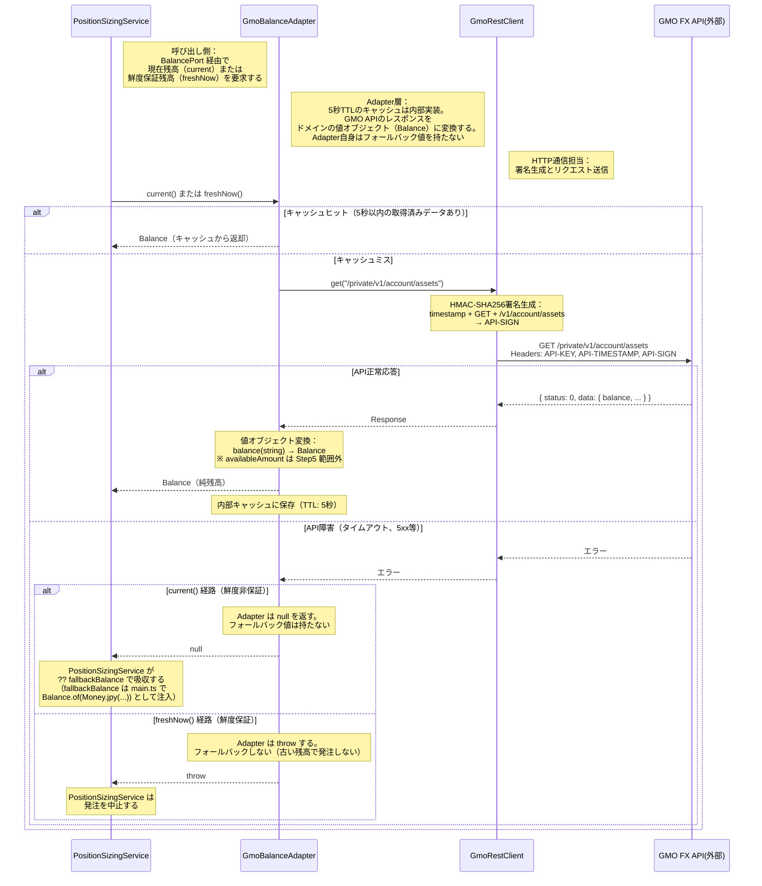

# シーケンス図: GMO口座残高取得フロー（Adapter層）

> 上位フロー multi-strategy-entry.md の `PositionSizingService` が残高を必要とする場面から先の通信手順を描く。

---

## 設計意図

- 5秒TTLのキャッシュでAPI呼び出しを最小化する。tickごとに残高APIを叩くと即座にレート制限に引っかかる。キャッシュは Adapter 内部実装で、クラス名・上位 Port 契約には出さない
- API障害時に Adapter 自身は null（current）または throw（freshNow）で正直に失敗を伝える。CAPITAL のような環境変数フォールバックは Adapter 層に持ち込まない
- フォールバック値（`fallbackBalance: Balance`）は `main.ts` で `Balance.of(Money.jpy(...))` として値オブジェクト化し、`PositionSizingService` のコンストラクタに注入する（policies.md 1.7 / 1.10.3 と整合）
- `PositionSizingService` は `BalancePort`（interface）にだけ依存する。キャッシュの有無や外部 API の存在を知らない
- 値オブジェクト変換は Adapter 層の中で完結する。string 型のレスポンスがドメイン層に漏れ出すことはない

## Step5 範囲外の事項（Note）

- 本シーケンスでは `balance` フィールドのみを返す経路を描いている。GMO API レスポンスの `availableAmount`（含み損益込み利用可能残高）を使った**利用可能残高ベースの上限チェックは Step5 範囲外**であり、`EntryQueue` 完成後（Step6 以降）の別 issue で対応する
- `BalancePort.availableAmount(): AvailableBalance` の追加、および `PositionManager` 側での `availableBalance = balance - usedMargin - pendingMargin` の組み立ては別 issue（policies.md 1.6 / brief.md 5.1 R5 参照）
