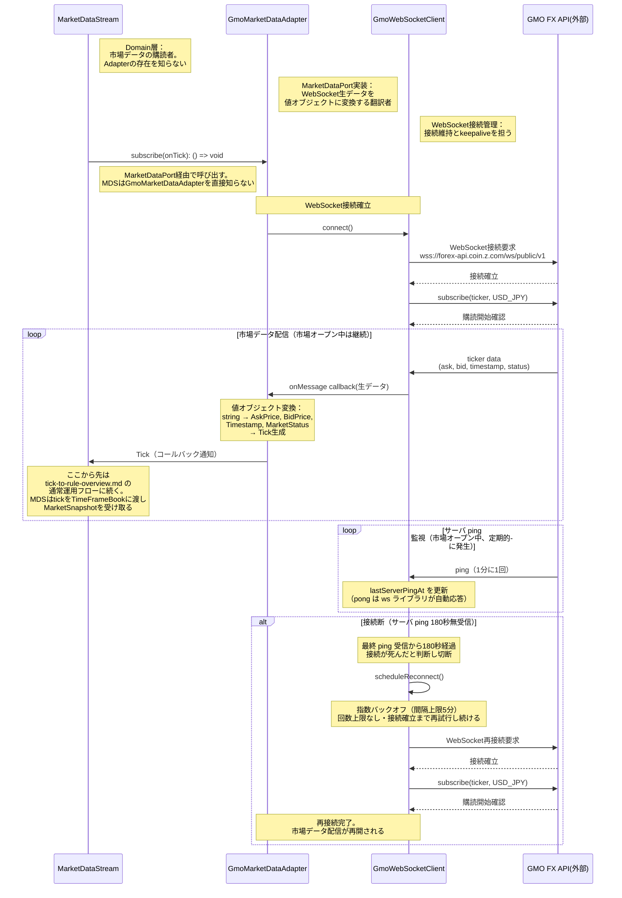

# シーケンス図: GMO市場データ取得フロー（Adapter層）

> 設計図ファイル（adapter-layer.drawio）に基づく。
> 上位フロー market-monitoring.md の MarketDataStream.start() を起点とし、
> Infrastructure層の具体的な通信手順を描く。

---

### 設計意図

- **MarketDataStreamは薄いブリッジ。** MarketDataPort経由でtickを受信し、TimeFrameBookに渡してMarketSnapshotを受け取り、listenerに通知するだけ。Adapterの存在もtickの加工方法も知らない
- **GmoMarketDataAdapterは翻訳者。** WebSocketから届く生のJSON文字列を、ドメインの値オブジェクト（AskPrice, BidPrice, Tick）に変換する。この変換がAdapter層の本質的な責務
- **GmoWebSocketClientは接続管理の専門家。** 接続確立、keepalive、自動再接続という通信インフラの関心事を引き受ける。GmoMarketDataAdapterは通信の詳細を知らなくてよい
- **再接続はWebSocketClientの責務。** サーバ ping の180秒無受信で切断し、指数バックオフ（間隔上限5分）で自動再接続する。回数上限は設けない——無人常駐のため打ち切ると復旧させる主体がなく、tick が止まったまま稼働し続けることになる（#342）。上位層（MarketDataAdapter, MarketDataStream）は接続断を意識しない
- **コールバック通知でリアクティブに配信。** push型の市場データ配信をリスナーパターンで表現。購読者（MarketDataStream）は到着を待つだけ
