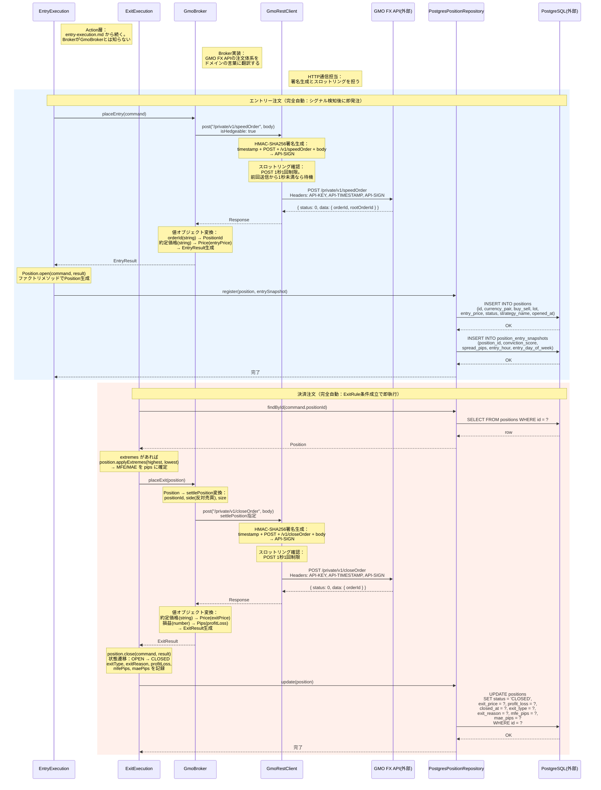

# シーケンス図: GMO注文執行フロー（Adapter層）

> 設計図ファイル（adapter-layer.drawio）に基づく。
> 上位フロー entry-execution.md / market-monitoring.md の
> Broker.placeEntry() / Broker.placeExit() から先の具体的な通信手順を描く。

---

### 設計意図

- **EntryExecutionもExitExecutionもGmoBrokerの存在を知らない。** Broker interfaceだけに依存する。実装がGMOかSBIかはAdapter層の関心事であり、Action層の関心事ではない
- **GmoBrokerは翻訳者。** ドメインのEntryCommand/PositionをGMO FX APIの注文パラメータに変換し、レスポンスをドメインのEntryResult/ExitResultに変換する。この双方向の翻訳がAdapterの本質
- **GmoRestClientは通信インフラの専門家。** HMAC-SHA256署名生成とPOST 1秒1回制限のスロットリングを担う。GmoBrokerは署名の詳細を知らなくてよい
- **エントリーと決済の非対称性はAdapter層にも表れる。** エントリーは `/private/v1/speedOrder`（isHedgeable: true で両建て対応）、決済は `/private/v1/closeOrder`（settlePosition指定）と、GMO FX APIの別エンドポイントを叩く。この違いをGmoBrokerが吸収する
- **ExitExecutionはPositionRepositoryからポジションを取得する。** ExitCommand（positionId）を受け取り、findById()でPositionエンティティを復元してからBrokerに渡す。applyExtremes()でMFE/MAEを確定させてからclose()を呼ぶ
- **PostgresPositionRepositoryはSQLの翻訳者。** PositionエンティティとRDBのテーブル行を相互変換する。エントリー時はINSERT、決済時はUPDATE。Domain層はSQLの存在を知らない
- **値オブジェクト変換の境界。** 外部APIのstring型レスポンスがドメインの値オブジェクトに変換されるのは、必ずAdapter層の中。プリミティブ型がドメイン層に漏れ出すことはない
