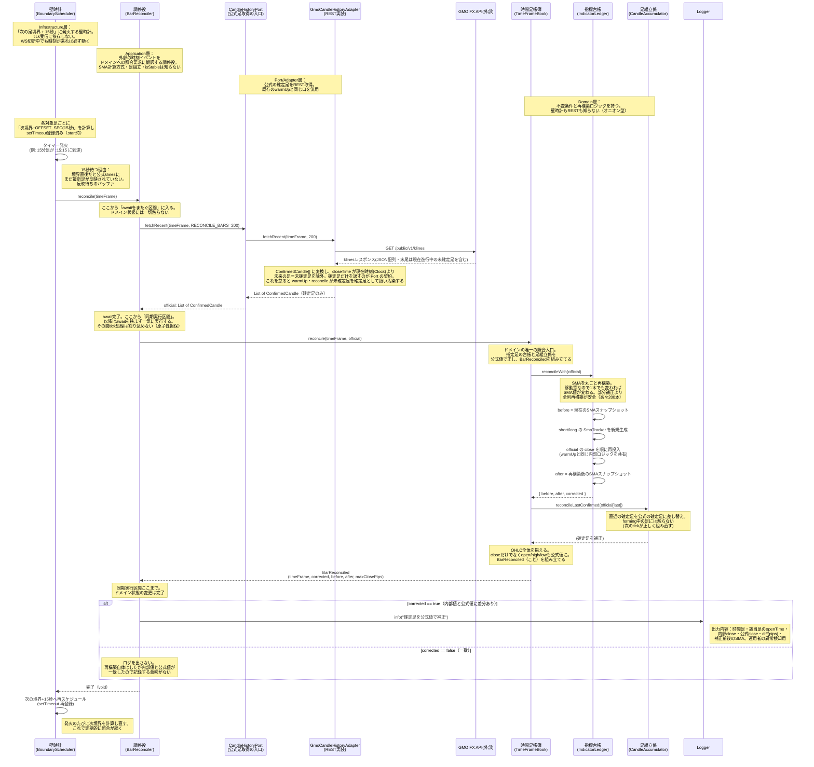
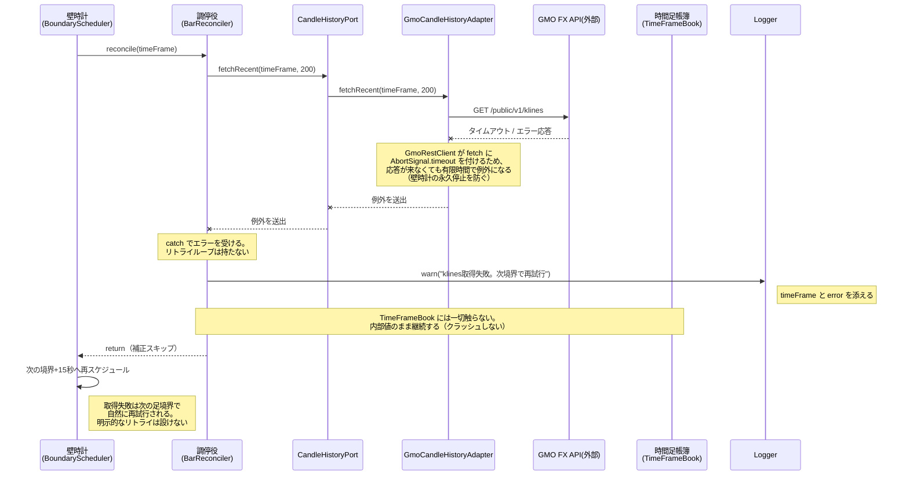
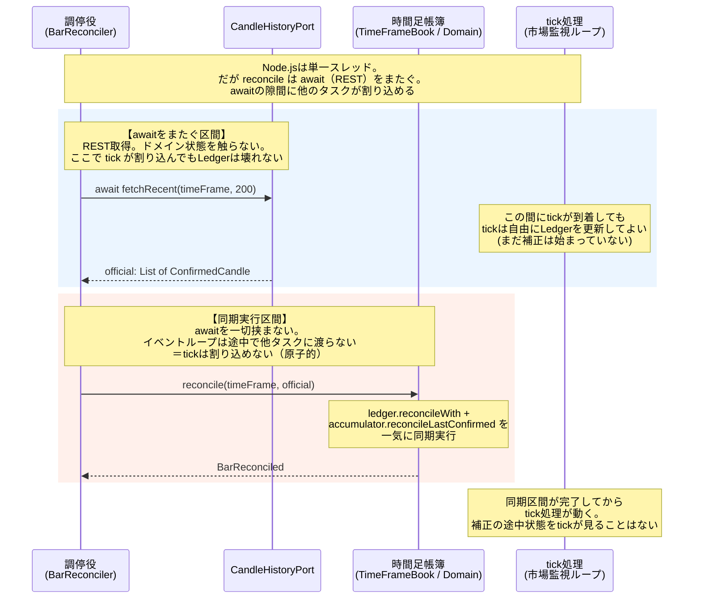

# シーケンス図: BarBoundaryWatchdog（足境界の壁時計補正）

> Issue #204 の機能設計（aidlc-docs/issue-204/construction/bar-boundary-watchdog/functional-design/）に基づく。
> 自前で組んだ確定足・SMA が、公式 klines とズレていないかを定期的に照合し、ズレていれば公式値を正として訂正するフロー。

---

## この機能が解く問題

- bot は WebSocket の tick を自分で足に組み立て（CandleAccumulator）、SMA を計算している（IndicatorLedger）
- WebSocket は切断・取りこぼしが起きうる。その間に組んだ足はズレる
- そこで「壁時計」（時刻そのもので動くタイマー）を使い、足の境界を少し過ぎたタイミングで公式の確定足を REST で取り直し、内部状態を正す
- **肝**: 壁時計は tick の受信状況に依存しない。WS が切断中で tick が1つも来ていなくても、時刻が来れば必ず発火する。だから「WS が死んでいる間にズレた足」を後から確実に拾える

---

## 1. 正常系（壁時計発火 → 照合 → 補正 → 再スケジュール）

### 補正がエントリーに波及しないこと（BR-9）

- reconcile は足・SMA の**補正のみ**。補正で SMA 関係が変わってもその場でエントリー判定（EntryRule）を能動トリガーしない
- 補正済みの SMA は次の tick / 通常の市場監視ループ（market-monitoring.md）が自然に使う

---

## 2. REST 障害系（公式足が取れなかったとき）

### なぜリトライループを持たないか（BR-8）

- 壁時計は定期的に必ず発火する。次の境界で自然に再試行される
- 独自のリトライループを足すと、複数の再試行が重なって複雑化する。壁時計の周期に任せるのが最も単純で堅牢

---

## 3. 競合制御 — 「awaitをまたぐ区間」と「同期区間」の分離（BR-10）

壁時計と tick は同じ `IndicatorLedger` を触る。両者がデータを壊し合わないための設計が肝になる。

### 設計のポイント

- **REST 取得（await）は TimeFrameBook を触らない。** 時間のかかる外部 I/O とドメイン状態の変更を物理的に分ける
- **取得完了後の `timeFrameBook.reconcile` は同期的に一気に実行する。** Node.js のイベントループは await を挟まない限り他タスクに制御を渡さない。この性質を使い「補正の途中状態を tick に見せない」を保証する
- 結果として、ロックやミューテックスを使わずに原子性を担保できる

---

## 登場人物と層（まとめ）

| 登場人物 | 層 | 役割 | 知ってよいこと / 知らないこと |
|---|---|---|---|
| BoundaryScheduler（壁時計） | infrastructure | 次境界+15秒に発火し再スケジュール | タイマー機構のみ。ドメインを知らない |
| BarReconciler（調停役） | application | 時刻イベントを照合要求に翻訳 | 対象足種・Port・Book の入口。SMA計算方式・足組立・isStableは知らない |
| CandleHistoryPort / GmoCandleHistoryAdapter | port / adapter | 公式 klines を REST 取得 | GMO REST、レスポンス→ConfirmedCandle変換 |
| TimeFrameBook（時間足帳簿） | domain | ドメインの照合入口。BarReconciledを組み立て | 不変条件。壁時計もRESTも知らない |
| IndicatorLedger（指標台帳） | domain | SMA を丸ごと再構築 | 再構築ロジック。壁時計もRESTも知らない |
| CandleAccumulator（足組立係） | domain | 直近確定足を公式値に差し替え | forming足には触らない |
| BarReconciled | domain（値オブジェクト） | 「照合・是正された」という出来事 | corrected が true のときだけ意味を持つ |

---

### 設計意図

- **watchdog にロジックを持たせない。** BarReconciler は「外部の時刻イベントを、ドメインへの照合要求に翻訳する」だけ。判断（どう正すか）はすべてドメインに閉じる
- **壁時計は tick に依存しない。** WS が切断中でも時刻が来れば必ず発火する。これが「取りこぼした足を後から確実に拾う」仕組みの肝
- **公式値が常に正。** 差分の有無で再構築するか否かを変えない（無条件に再構築）。ただしログは差分があったときだけ出す（corrected == true）
- **SMA は丸ごと再構築。** 移動窓なので窓内の1本でも変われば SMA 値が変わる。部分補正は「どの本が変わったか」を追う複雑さを生むだけ。高々200本ならコストは無視できる
- **OHLC 全体を揃える。** close だけでなく open / high / low も公式値に揃える（ConfirmedCandle が OHLC を Price で保持）
- **REST 障害はリトライしない。** WARN ログを出して return。次の境界で自然に再試行される。bot は内部値のまま継続しクラッシュしない
- **補正はエントリーに波及しない。** reconcile は足・SMA の補正のみ。補正済み SMA は次の tick / 通常の市場監視ループが使う
- **競合制御は await 区間と同期区間の分離で実現。** REST（await）はドメインを触らず、ドメイン変更は同期一括で行う。ロック不要で原子性を担保する
- **テスト容易性。** BoundaryScheduler は clock（現在時刻）と timer（setTimeout）を注入可能にし、テストで時刻を進められる。CandleHistoryPort はモック可能

---

## 関連シーケンス図

| 関連 | 図 | 説明 |
|---|---|---|
| 起動・warmUp | [startup-flow.md](startup-flow.md) | watchdog は warmUp 完了後に起動する（BR-11）。reconcileWith は warmUp と内部ロジックを共有 |
| 補正後の SMA を使う側 | [market-monitoring.md](market-monitoring.md) | 補正済み SMA を次の tick / 市場監視ループが参照する |
| 公式足取得の通信詳細 | [gmo-market-data-flow.md](../adapter/gmo-market-data-flow.md) | GMO REST / WebSocket の通信詳細 |
