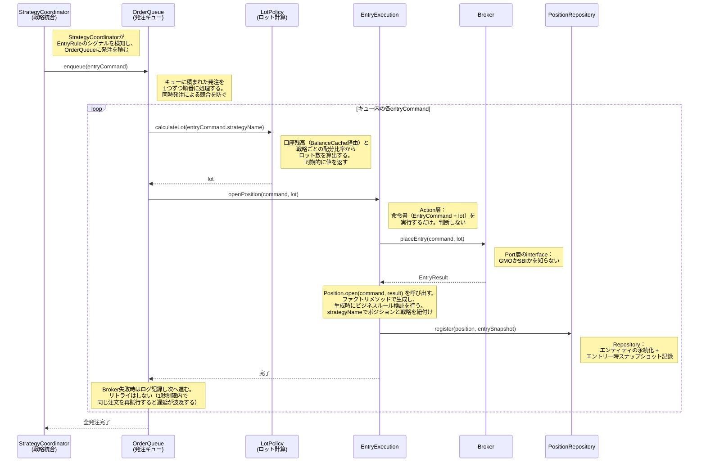

# シーケンス図: エントリー執行フロー

> 設計図ファイル（action-layer.drawio, trading-session.drawio, positions.drawio）に基づく

---

### 設計意図

- **起点はStrategyCoordinator。** market-monitoring.md でEntryRuleがシグナルを検知した後、StrategyCoordinatorがOrderQueueに発注を積む
- **OrderQueueが発注の順序を制御。** 複数戦略が同時にシグナルを出した場合、キューに積んで1つずつ処理する。同時発注による競合（証拠金不足等）を防ぐ
- **LotPolicyでロット計算。** 口座残高（BalanceCache経由で同期的に取得）と戦略ごとの配分比率からロット数を算出する。EntryExecution自体はロット計算の責務を持たない
- **EntryExecutionは命令書を実行するだけ。** 「エントリーすべきか」の判断はEntryRuleが済ませている。判断と執行の分離
- **BrokerはPort層のinterface。** 実装がGMOかSBIかをEntryExecutionは知らない。依存の方向がドメインからインフラに向かわない
- **Position.open()はファクトリメソッド。** コンストラクタではなくファクトリメソッドで生成することで、生成時のビジネスルール検証を表現する。strategyNameをPositionに持たせ、戦略とポジションを紐付ける
