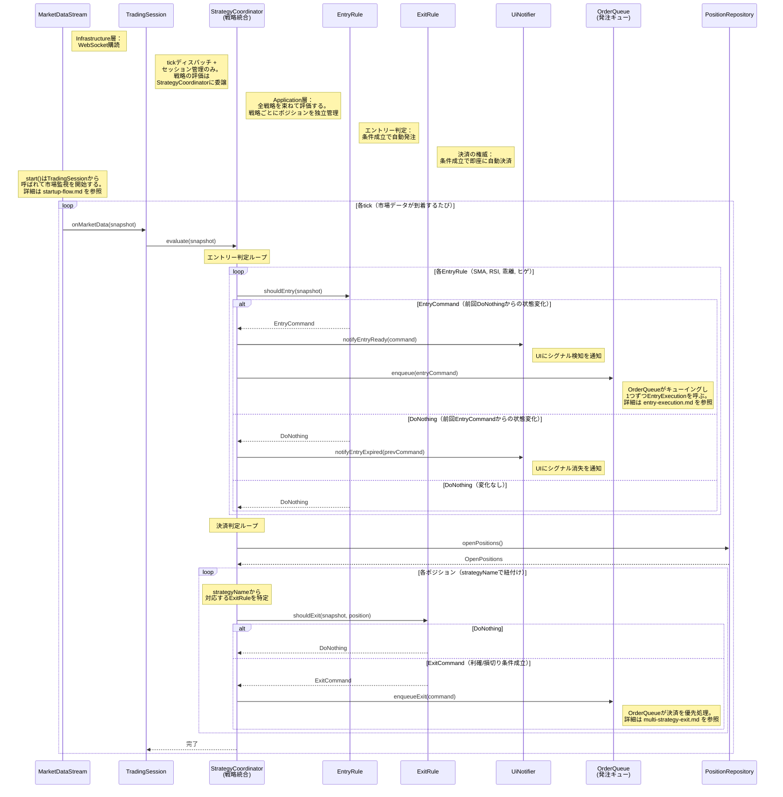

# シーケンス図: 市場監視・自動売買フロー

> 設計図ファイル（rule-layer.drawio, trading-session.drawio, positions.drawio）に基づく

---

### 設計意図

- **TradingSessionはtickディスパッチとセッション管理のみ。** Rule評価のループはStrategyCoordinatorが担う。TradingSessionは薄く保つ
- **StrategyCoordinatorが全戦略を束ねる。** Application層に位置し、全EntryRule/ExitRuleを順に評価する。戦略ごとにポジションを独立管理する
- **1ポジション制約は撤廃。** 複数の戦略が同時にポジションを持てる。strategyNameでポジションとRuleを紐付ける
- **エントリーも決済も完全自動。** EntryRuleがシグナル検知→OrderQueueに積む→EntryExecutionで自動発注。決済もOrderQueue経由で自動執行。人間の判断を介在させない
- **OrderQueueがエントリーと決済の両方を制御。** GMO POST API の1秒1回制限を1つのキューで管理。決済はエントリーより優先度が高い。詳細は entry-execution.md / multi-strategy-exit.md を参照
- **UiNotifierはシグナル状態の通知のみ。** notifyEntryReady/notifyEntryExpiredはUIにシグナルの検知・消失を表示するためのもの。発注の可否を制御するものではない
- **ExitRuleは3大権威の1つ。** 利確・損切りの全権を握る。条件成立＝即執行
- **市場監視と判定が同一ループ内。** tickごとにエントリー判定→決済判定→OrderQueueへの投入が連続して行われる。実際の発注・決済の執行はOrderQueueが非同期で処理する（詳細は entry-execution.md / multi-strategy-exit.md）
- **Ruleは純粋な判定関数。** shouldEntry/shouldExitを呼ばれて結果を返すだけ。副作用を持たない
- **状態変化時のみ通知。** StrategyCoordinatorが`prevEntryResults`（Map<EntryRule, EntryCommand | DoNothing>）で前回の判定結果を保持し、状態が変わった時のみUiNotifierに通知する（同じ結果が連続しても重複通知しない）
