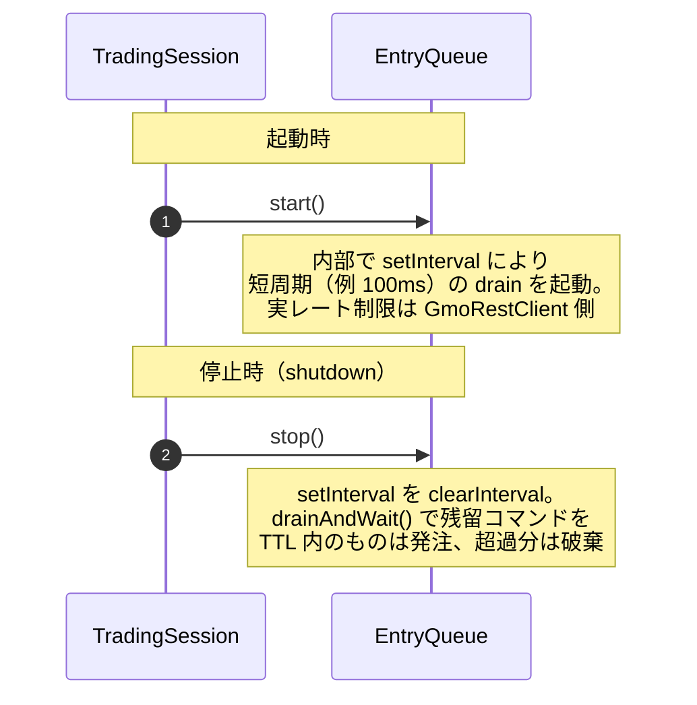
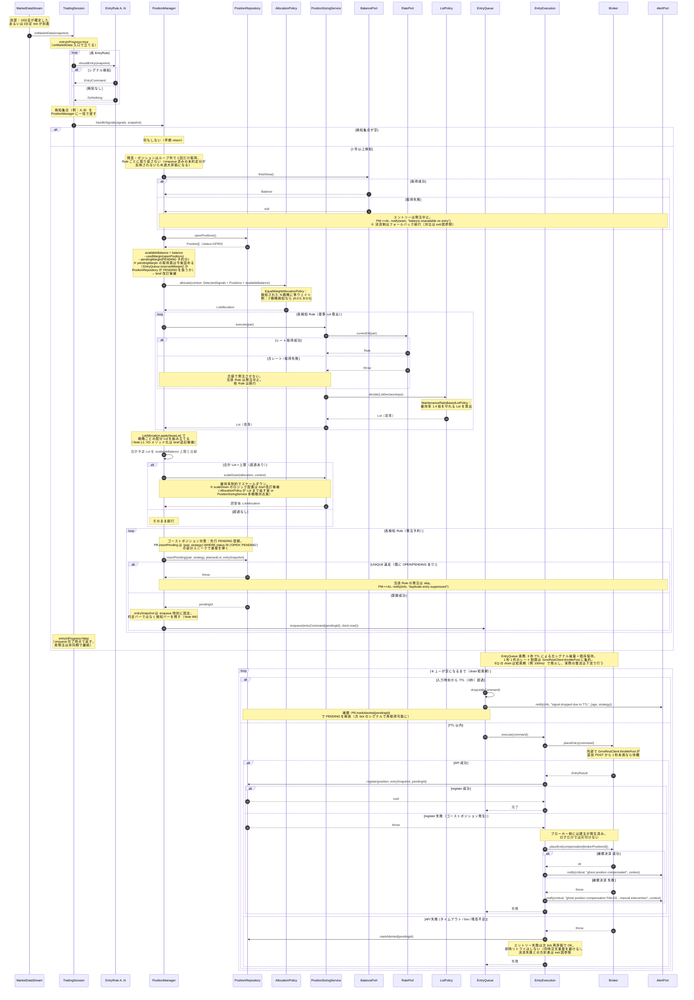

# 多戦略エントリーフロー

> Issue #51 で新設される PositionManager による、複数 EntryRule が同時にシグナルを出したときの発注フロー。
> 既存の `entry-execution.md`（単一命令の執行）と `tick-to-rule-overview.md`（tick から Rule 判定まで）の続きに位置する。

---

## 目的

- 複数の EntryRule（SMA クロス / RSI 逆張り / SMA 乖離逆張り / ヒゲ逆張りなど）が同一 tick で同時にシグナルを返した場合、検知集合を一括で受け取り、配分 → サイジング → 上限チェック → キューイング → 発注まで一気通貫に司令する層（`PositionManager`）の振る舞いを示す
- 「誰が残高を取得するか」「誰が Lot を決めるか」「誰が発注間隔を守るか」「発注失敗時に何が起きるか」を曖昧にせず、参加者ごとの責務を時系列で明確化する
- 古シグナル破棄・(pair, strategy) OPEN ユニーク制約・API 失敗時のフォールバック・ゴーストポジション補償など、失敗系の分岐も 1 本の図に畳み込む

## 前提

- 確定する時間足は個々の Rule が指定する（1 分足 / 15 分足 / 1 時間足 / 日足。Rule ごとに異なる時間足でもよい）。**PositionManager 自身は時間足非依存**
- 稼働中の Rule は `TradingSession.entryRules` に登録済み。現時点で実運用されているのは SMA クロス 1 本のみ。**Rule #2 以降は将来実装**。図では「複数戦略（N 個）」として抽象表現する
- PositionManager は `AllocationPolicy` / `PositionSizingService` / `EntryQueue` / `AlertPort` / `Clock` を DI されている
- 両建て許容設定（GMO API: `isHedgeable: true`）
- `positions` テーブルには `(pair, strategy_name) WHERE status='OPEN'` の部分ユニークインデックスが張られている
- `BalancePort.current()` はキャッシュ値（5 秒 TTL）を返す。`BalancePort.freshNow()` は発注直前のバイパス取得
- `RatePort.currentOf(pair)` は古レート時に例外を投げる（内部で `snapshot.tick.capturedAt` から N 秒（暫定 1 秒）以上経過していれば例外）
- TTL・drain 間隔の時刻判定は全て `Clock` ポート経由。`Date.now()` の直書き禁止

## 登場人物

| 参加者 | 層 | 役割 |
|---|---|---|
| MarketDataStream | infrastructure | 外部 WebSocket から tick / 確定足を受け取り、`MarketSnapshot` を購読者へ配信する薄いブリッジ |
| TradingSession | application | `onMarketData` で全 EntryRule を順に評価し、検知集合を PositionManager に引き渡す |
| EntryRule A..N | domain | 市場データだけを見て「入るか入らないか」を判定。`EntryCommand` か `DoNothing` を返す純粋関数 |
| PositionManager | action | 多戦略シグナルの司令塔。配分・サイジング・上限チェック・キューイングを束ねる |
| PositionRepository | port | 現在の保有ポジション取得、PENDING 登録、発注後の OPEN 確定 |
| AllocationPolicy | domain | 検知シグナル・保有ポジション・残高から `LotAllocation`（配分比率）を返すドメインサービス。初期実装は `EqualWeightAllocationPolicy` |
| PositionSizingService | action | 残高取得・フォールバック・`LotPolicy` 呼び出しを組み立てる。多戦略対応として `scaleDown` を提供（候補） |
| BalancePort | port | 残高取得。`current()` はキャッシュ、`freshNow()` は発注直前のバイパス |
| RatePort | port | 最新レート取得。古い時は例外 |
| LotPolicy | domain | 入力値オブジェクトから Lot を決定する純粋ドメインサービス。初期実装は `MaintenanceRatioBasedLotPolicy` |
| EntryQueue | action | 発注キュー。古シグナル破棄（3 秒 TTL）と順序保持を担う。**1 秒 1 件のレート制限自体は GmoRestClient 側に集約** |
| EntryExecution | action | `EntryCommand` を 1 本実行する既存コンポーネント。判断しない |
| Broker | port | GMO / 他社を抽象化した発注インターフェース。実装は `GmoBrokerAdapter`。内部で `GmoRestClient.throttlePost` がレート制限を担う |
| AlertPort | port | Slack / Discord / Webhook 等への通知抽象。`notify(severity, message, context)` を提供 |
| Clock | port | 時刻取得の抽象。TTL・drain 間隔の基準 |

---

## 初期化 / 終了フロー

Note: `TradingSession` は `entryInProgress` を `onMarketData` 入口で立て、`PM.handleSignals` の `enqueue` 完了時点で false に戻す（下図参照）。実発注は非同期なので、発注完了の await は shutdown 時の `drainAndWait` で明示的に取る。

---

## フロー図（メイン）

---

## 主要なポイント

1. **PositionManager は時間足非依存**。Rule が 1 分足で発火しようが日足で発火しようが、司令塔の処理は同じ
2. **配分とサイジングは分離**。`AllocationPolicy` は戦略ごとの比率を返し、`PositionSizingService` は残高から基準 Lot を返す。将来 Kelly / リスク予算（#121）への差し替えは `AllocationPolicy` の交換で済む
3. **残高・ポジションはループ外で 1 回だけ取得**。Rule ごとに取り直すと enqueue 済みの未約定分を二重計上してしまう。`availableBalance = balance - usedMargin - pendingMargin` で過大評価を防ぐ
4. **ゴーストポジション対策**: 先行 PENDING 登録で (pair, strategy) の重複を DB で弾き、それでも `register` が失敗した場合は補償決済を即実行する。ログだけで流さない
5. **1 秒 1 件制約は GmoRestClient に集約**。`EntryQueue` は「TTL 破棄 + 順序保持」に専念する。責務の二重化を避ける
6. **古シグナル破棄の注意点**: 4 戦略同時検知時、1 秒 1 件ペースで処理すると 4 本目は T=3s 付近で TTL 破棄に引っかかる可能性がある（Note C7）。優先度順（損切り > 利確 > エントリー）や Rule 別 TTL は brief 改訂候補
7. **entryInProgress の境界**: `onMarketData` 入口で true、`enqueue` 完了時点で false。実発注は非同期。shutdown 時の `drainAndWait` で完了を待つ
8. **Clock 経由の時刻判定**: `Date.now()` 直書き禁止。テスト容易性と挙動の決定性のため

## 失敗系・エッジケース

- **検知集合が空**: `handleSignals` 冒頭で早期 return
- **BalancePort.freshNow() が null（エントリー時）**: 発注中止。`AlertPort.notify(warn)`。決済側とポリシーが異なる点に注意（H4）
- **RatePort.currentOf() が例外**: その Rule の発注中止。他 Rule は続行
- **PENDING UNIQUE 違反**: 発注 skip。`AlertPort.notify(info)`
- **EntryQueue で TTL 超過**: シグナル破棄 + PENDING 解放 + `AlertPort.notify(info)`
- **Broker.placeEntry() が失敗**: PENDING 解放。リトライしない。次 tick に委ねる
- **register() 失敗（ゴーストポジション）**: 補償決済を即実行。成功しても critical アラート。失敗時はオペレータ介入 critical アラート

## Note（brief 改訂候補）

- **scaleDown の配置**: `PositionSizingService.scaleDown` か `AllocationPolicy` が Lot まで返す形か、brief 5.2 の「維持率制約でスケールダウン」実装パスを確定する
- **pendingMargin の取得源**: `EntryQueue.reservedMargin()` or `PositionRepository` に PENDING 状態を正式導入
- **Rule 別 TTL / 優先度**: 3 秒一律では 4 戦略同時検知の 4 本目が危うい。brief 5.5 を拡張する候補
- **LotAllocation.apply(baseLot) の VO メソッド化**: 「基準 Lot × 比率 = 配分 Lot」をドメインに閉じる（Note L1）
- **entrySnapshot の鮮度**: enqueue 時刻に固定する方針を brief に追記（Note M4）
- **prevEntryResults の配置**: TradingSession に残すか Rule 側に押し込むか（Note M5）

## 関連ドキュメント

- `docs/design/position-manager/brief.md`（5.1 / 5.2 / 5.4 / 5.5 で本図の前提となる方針）
- `docs/design/sequence/core/entry-execution.md`（EntryExecution 単体の既存フロー）
- `docs/design/sequence/core/tick-to-rule-overview.md`（MarketDataStream から Rule 判定までの前段）
- `docs/design/sequence/core/multi-strategy-exit.md`（決済側の対応フロー）
- `docs/design/sequence/adapter/gmo-account-assets.md`（BalancePort の Adapter 側フロー）
- `docs/design/sequence/adapter/gmo-order-flow.md`（Broker の POST 1 秒制限詳細）
- `docs/design/class/position-manager/composition-entry-flow.drawio`（参加者の静的関係）
