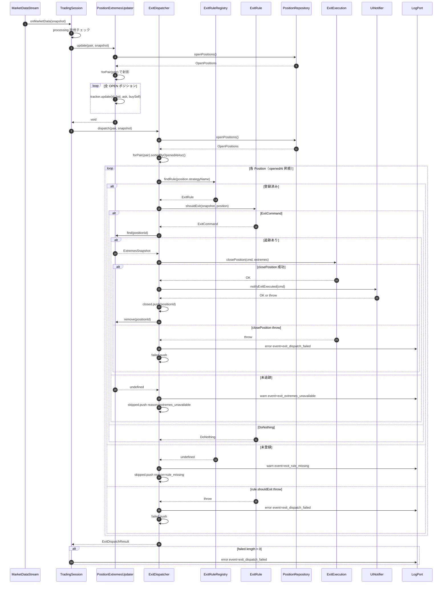

# 複数戦略 Exit 評価フロー（multi-strategy-exit）

Issue #51 Step 8 / PR B で導入する `ExitDispatcher` を中心とした **戦略別 ExitRule ディスパッチ** のシーケンス図。

## 目的

`TradingSession` から `(pair, snapshot)` を受けて、pair に紐づく全 OPEN ポジションに対し **戦略ごとの ExitRule を独立に評価** する。`(pair, strategy_name)` 単位の決済が成立する。

## 登場人物

| Participant | 責務 |
|---|---|
| `TradingSession` | tick 受信のエントリポイント。`processing` 排他で再入抑止 |
| `PositionExtremesUpdater` | 全 OPEN ポジションの MFE/MAE 追跡を進める |
| `ExitDispatcher` | 戦略別 ExitRule lookup → 評価 → 決済 → 通知 |
| `ExitRuleRegistry` | `StrategyName → ExitRule` の不変マッピング |
| `ExitRule`（戦略別） | 単一戦略の決済判定 |
| `PositionRepository` | OPEN ポジション集合の取得 |
| `ExitExecution` | broker への決済 API 呼び出し + DB 更新 |
| `UiNotifier` | フロントエンドへの決済通知 |
| `LogPort` | 構造化ログ出力 |

## シーケンス

## 例外境界

| 層 | throw 時の挙動 | 観測 |
|---|---|---|
| `registry.findRule` が undefined | `warn` + `skipped(reason: 'rule_missing')` + continue | `event: 'exit_rule_missing'` |
| `registry.findRule` 自体が throw（想定外）| 再 throw（防衛的握りつぶしなし）| dispatch 全体が rejects |
| `registry.ruleFor`（起動時 fail-fast 用 / `MissingExitRuleError`）| main.ts 起動失敗 / PM2 起動中止 | PR C で利用 |
| `extremesPort.find` が undefined | `warn` + `skipped(reason: 'extremes_unavailable')` + 次 tick 再評価 | `event: 'exit_extremes_unavailable'` |
| `rule.shouldExit` throw | `error` + `failed` 記録 + continue | `event: 'exit_dispatch_failed'` |
| `exitExecution.closePosition` throw | `error` + 通知 skip + `failed` 記録（次 tick 再評価契約）| `event: 'exit_dispatch_failed'` |
| `uiNotifier.notifyExitExecuted` throw | `error` + `closed` に積む（決済確定済）| `event: 'exit_notify_failed'` |

## ログ重複防止

`exitExecution.closePosition` の throw は `closeAndNotify` 内ではログを出さず再 throw のみ。**上位 `dispatch` の catch で 1 箇所だけ `exit_dispatch_failed` ログを出す**。`closeAndNotify` 内ログ + 外側 catch ログの二重出力にしない。

## PR C 統合後の挙動

- 本 PR B では `ExitDispatcher` は `main.ts` から呼ばれない（DI 配線未済）
- PR C で `TradingSession.onMarketData` から `extremesUpdater.update → exitDispatcher.dispatch → positionManager.handleSignals` の順で呼び出されるよう配線する
- PR C 統合後、Updater / Dispatcher が独立に `openPositions()` を呼ぶ二重取得は将来統合予定（TradingSession が 1 度読んで両者に渡す形）

## 関連設計書

- `docs/design/position-manager/step8-brief.md` (v3.1)
- `docs/design/position-manager/step8-pr-b-impl-plan.md`
- `docs/design/position-manager/policies.md` 2.5
- `docs/design/value-objects.md`
