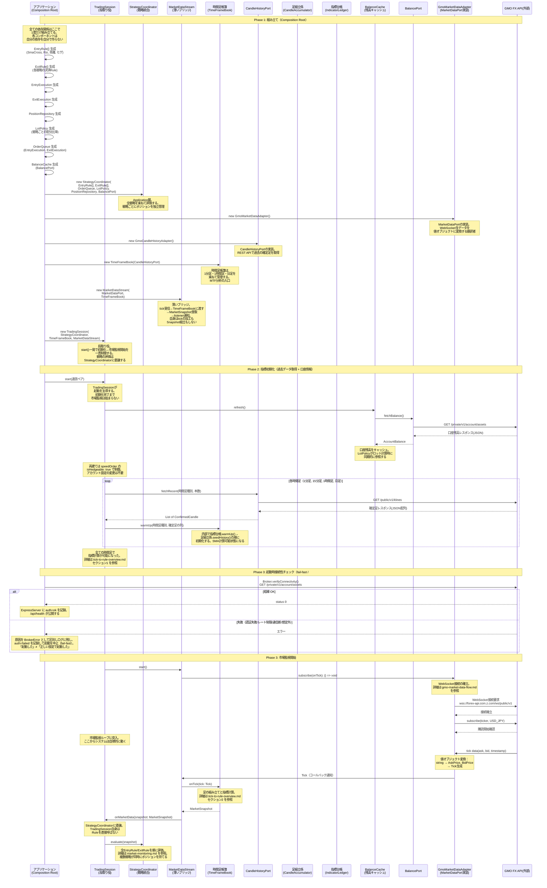

# シーケンス図: 起動フロー（システム起動から市場監視開始まで）

> ユーザーがシステムを起動してから、市場監視ループが回り始めるまでの全体像。
> 既存の3つのシーケンス図（tick-to-rule-overview.md, market-monitoring.md, gmo-market-data-flow.md）を繋ぐ「地図」の役割を果たす。

---

## 1. 全体像

---

## 2. 既存シーケンス図との関係

| Phase | ステップ | 詳細を描いている既存図 | 説明 |
|-------|----------|------------------------|------|
| Phase 2 | TradingSession.start() の初期化処理 | [tick-to-rule-overview.md](tick-to-rule-overview.md) セクション1 | 各時間足の確定足取得（fetchRecent）、TimeFrameBook.warmUp() の詳細 |
| Phase 3 | tick到着後の足組み立てと指標計算 | [tick-to-rule-overview.md](tick-to-rule-overview.md) セクション2 | CandleAccumulator.accumulate(tick)、足確定判定、IndicatorLedger更新、MarketSnapshot組立の詳細 |
| Phase 3 | Rule判定と自動決済 | [market-monitoring.md](market-monitoring.md) | StrategyCoordinator.evaluate()、EntryRule.shouldEntry()、ExitRule.shouldExit()、ExitExecution.closePosition() の詳細 |
| Phase 3 | WebSocket接続確立と再接続 | [gmo-market-data-flow.md](../../sequence/adapter/gmo-market-data-flow.md) | GmoWebSocketClientの接続管理、keepalive、自動再接続の詳細 |
| Phase 3 | エントリー発注の詳細 | [entry-execution.md](entry-execution.md) | StrategyCoordinator → OrderQueue → LotPolicy → EntryExecution の詳細 |

---

### 設計意図

- **Composition Root で1度だけ組み立てる**: 全ての依存関係はアプリケーション起動時にMainが組み立てる。各コンポーネントは自分の依存を自分で作らない。これにより依存の方向が制御され、テスト時にPort実装を差し替えられる
- **Phase 2 で StrategyCoordinator, LotPolicy, OrderQueue, BalanceCache を追加**: 複数戦略の同時運用に必要なコンポーネント群。全てComposition Rootで組み立てる
- **口座残高を起動時に取得**: BalanceCacheにキャッシュし、LotPolicyがロット計算時に同期的に参照する。BalancePortはGMO APIのREST呼び出しを抽象化する
- **両建てはAPIリクエストで制御**: speedOrder に `isHedgeable: true` を付与することで、アカウントの両建て設定に関係なく新規建てとして約定する。起動時のアカウント設定確認は不要
- **TradingSession が起動の全権を持つ**: 段取り役として口座残高取得 → CandleHistoryPort.fetchRecent() → TimeFrameBook.warmUp() → MarketDataStream.start() の順序を一貫制御する。Main->>TS: start(通貨ペア) の1行で全てが始まる
- **TradingSession は StrategyCoordinator に委譲**: tickディスパッチとセッション管理のみ。Rule評価のループはStrategyCoordinatorが担う
- **MarketDataStream は薄いブリッジ**: tick受信 → TimeFrameBookに渡す → MarketSnapshot受取 → listener通知。自身はtickの加工もSnapshot組立もしない。何もしないことで肥大化を防ぐ
- **エントリーも決済も完全自動**: EntryRuleがシグナル検知 → OrderQueue経由で自動発注。ExitRuleが条件成立 → 即座にExitExecutionで自動決済。人間の判断を介在させない
- **時間足は4種固定**: 1分足（エントリーシグナルの発火元）、15分足（SMAクロス判定）、1時間足（中期トレンドの確認）、日足（大局の方向性確認）。追加時はTimeFrame enumを拡張するだけ
- **起動時接続性チェックで fail-fast（#290）**: 市場監視を始める前に Broker.verifyConnectivity() で private API（account/assets）を1本叩き、正しく結線されているか確認する。失敗（認証失敗・レート制限・通信断・想定外）なら原因に関わらず起動を中止する。「起動した」≠「正しい設定で起動した」を区別し、壊れた API キーのまま稼働し続けること（#287 の検知遅延 65 分）を防ぐ。失敗原因は BrokerError として区別してログに残し、運用者が打ち手を誤らない（正しい鍵を疑う等）ようにする。結果は ExpressServer が保持し /api/health の auth フィールドで公開、luchida -c が起動可否まで監視できる。**現状はどの失敗でも起動中止だが、レート制限など一過性の失敗に対するリトライ/様子見の線引き、および稼働中の連続失敗に対する停止回路（TradingGuard 原型・発注は止めるが Exit は止めない）は #290 Step2 で別途設計する。** authStatus / reportAuthStatus は当面 ExpressServer が保持するが、本来は取引可否を判断する番人（TradingGuard 前身）が持つべき状態の仮宿であり、Step2 で health を番人経由に剥がす想定。剥がす際、実態が「接続性の結果」なので `auth` という語も接続性を表す語に直す（現状は health の後方互換のため `auth` を踏襲）。
  - **Step2 申し送り（認証失敗コードの網羅）**: 現状 GmoApiError.isAuthenticationFailed() は ERR-5012 のみを認証失敗とみなす。署名タイムスタンプずれ・API キー無効など他の認証系コードがあれば `unexpected` に落ち、運用者が鍵を疑えない（#287 と逆向きの取りこぼし）。GMO 仕様で認証失敗コードを洗い出して網羅する
- **TradingGuard は次フェーズ**: 経済指標発表・APIメンテナンス・異常検知で全取引禁止 + ポジション決済指示。3大権威の中で最大権力を持つゲートキーパー。他の権威の命令も握りつぶせる。現在のPhase 1-3のフローに割り込む形で将来追加される
- **この図は「地図」である**: 各Phaseの詳細には深入りせず、既存のシーケンス図に委譲する。起動フローの全体像を俯瞰し、「どこを見ればよいか」を示すナビゲーションの役割を果たす
