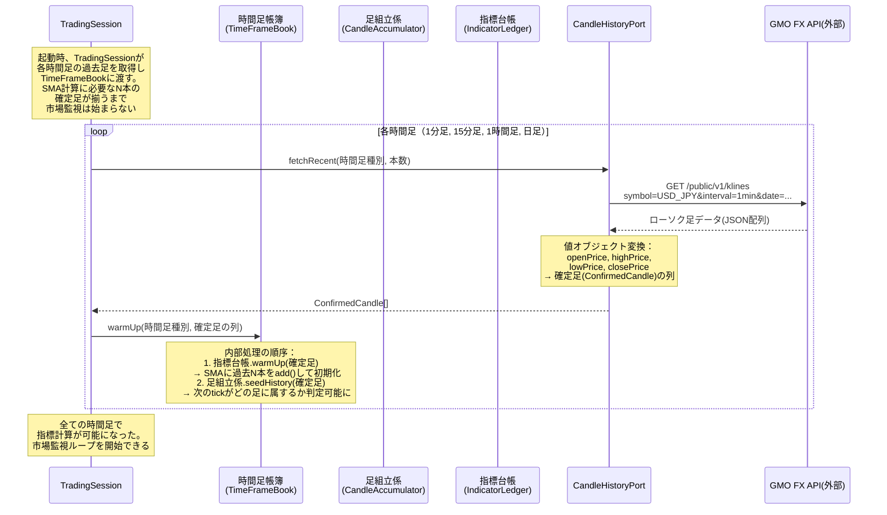
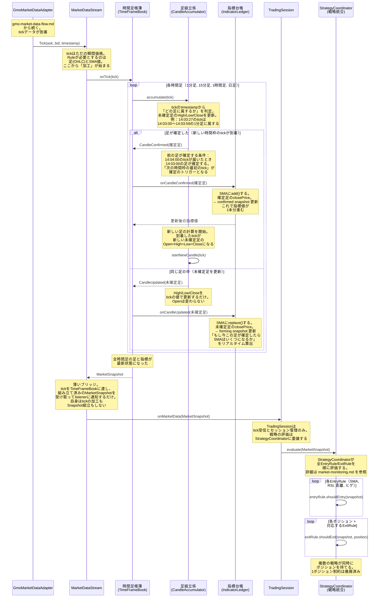
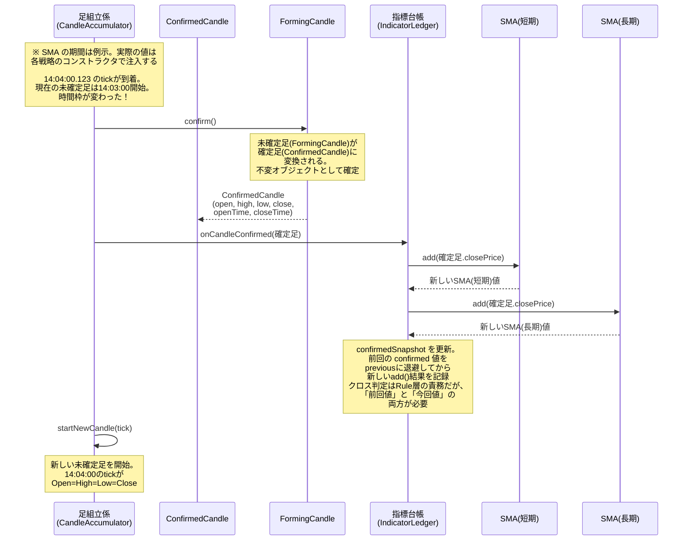

# シーケンス図: tickデータからRule判定までの全体像

> tickがローソク足に組み立てられ、テクニカル指標が計算され、Ruleが判定するまでの流れ。
> 既存の market-monitoring.md の MarketDataStream → TradingSession 間に、
> 「足の組み立て」と「指標計算」という2つの責務を挿入する。

---

## 1. 起動時: 過去データからの指標初期化

---

## 2. 通常運用: tickごとの未確定足更新とRule判定

---

## 3. 足確定時の詳細フロー（拡大図）

---

## 設計メモ

### 命名の判断理由

| 仮名 | 採用名 | 理由 |
|---|---|---|
| CandleStickBuilder | **足組立係（CandleAccumulator）** | 「Builder」はGoFパターンの技術用語。ドメインの人間は「足を組み立てる」と言う。accumulateは「蓄積する」で、tickを蓄積して足にする行為を正確に表す。builderよりもドメインに近い |
| IndicatorCalculator | **指標台帳（IndicatorLedger）** | 「Calculator」は計算機。しかしこのクラスの本質は「計算すること」ではなく「指標値を管理・保持すること」。台帳（Ledger）は値を記録し保持する帳簿であり、SMA値の現在値・前回値を保持して提供する責務を的確に表す |
| TimeFrameManager | **時間足帳簿（TimeFrameBook）** | 「Manager」は何でも屋の危険信号。帳簿（Book）は「注文帳簿（OrderBook）」と同じ用法で、複数の時間足を束ねて管理する台帳。MTF分析の入口として、足組立係と指標台帳を時間足ごとにペアで保持する |
| MarketData | **相場概況（MarketSnapshot）** | 既存設計ではMarketDataだったが、tickからSMA値まで含む「加工済みの全体像」になった。Snapshotは「ある瞬間の断面」を表し、Ruleが判定に必要な情報の断面写真である |
| 未確定足 | **FormingCandle** | 「形成中の足」。まだ確定していない、変化し続ける足。formingは進行形で「作られつつある」状態を表す |
| 確定足 | **ConfirmedCandle** | 「確定した足」。不変オブジェクト。一度確定したら二度と変わらない |
| SmaSnapshotなし | **SmaSnapshot** | SMA値の断面写真。confirmed（確定足ベース）とforming（未確定足ベース）で同じ構造を共有する。4つのSMA値（短期・長期 × 現在・前回）を不変オブジェクトとして保持 |

### 責務分担の考え方

**「誰が何を知っているか」で責務を切る。**

- **足組立係（CandleAccumulator）**: tickのtimestampと時間枠の関係だけを知っている。SMAの存在を知らない。指標台帳の存在を知らない
- **指標台帳（IndicatorLedger）**: 確定足のclosePriceからSMA値を計算・保持する。trading-signalsライブラリの存在を知っているのはここだけ。足の組み立て方を知らない
- **時間足帳簿（TimeFrameBook）**: 足組立係と指標台帳を時間足ごとにペアで保持する。組み立ての詳細も指標計算の詳細も知らない。「確定した」というイベントを足組立係から受け取り、指標台帳に中継するだけ
- **相場概況（MarketSnapshot）**: 値オブジェクト。振る舞いを持たない。Ruleが判定に必要な情報の断面写真
- **StrategyCoordinator（戦略統合）**: application層。全EntryRule/ExitRuleを束ねて順に評価する。戦略ごとにポジションを独立管理し、複数戦略の同時運用を可能にする
- **TradingSession（段取り役）**: tickディスパッチとセッション管理のみ。戦略の評価はStrategyCoordinatorに委譲する
- **Rule**: 相場概況だけを受け取る。足の組み立て方も、SMAの計算方法も、trading-signalsライブラリの存在も知らない。純粋な判定関数

**既存設計との接合点:**
- MarketDataStreamは薄いブリッジ。tickをTimeFrameBookに渡し、組み立て済みのMarketSnapshotを受け取ってlistenerに通知するだけ。tick加工もSnapshot組立もTimeFrameBookの責務
- TradingSessionのonMarketData内でStrategyCoordinator.evaluate(snapshot)を呼ぶ。TradingSession自身はRuleを直接呼ばない
- EntryRule/ExitRuleのインターフェースが `shouldEntry(snapshot: MarketSnapshot)` に変わる

### 未決定事項

1. **RuleはtickごとにN回呼ばれるのか、足確定時だけ呼ばれるのか？**
   - 現時点の設計: **tickごとに呼ぶ**。未確定足のreplace()でSMAがリアルタイム更新されるため、足確定を待たずにクロスを検知できる
   - トレードオフ: tickごとに呼ぶと「未確定足のSMAクロス→次のtickで元に戻る」という**ダマシ**が発生しやすい
   - 将来の選択肢: Rule側で「確定足ベースのクロスのみ有効」と判断することも可能。その場合、相場概況に「直前の足が確定したか」フラグを持たせる

2. **時間足帳簿が管理する時間足の種類は誰が決めるか？**
   - 候補A: 設定ファイル（YAML等）で定義
   - 候補B: Rule自身が「自分はこの時間足が必要」と宣言する
   - 見解: Ruleが宣言する方がドメインに近い。Ruleは自分の判定に何が必要かを知っている

3. **相場概況（MarketSnapshot）の中身の詳細設計**
   - 全時間足の情報をフラットに持つか、時間足種別をキーとしたMapで持つか
   - クロス状態（GoldenCross/DeadCross/NoCross）は相場概況に含めるか、Rule内で判定するか
   - 見解: クロス判定はRuleの責務。相場概況はSMA値（数値）だけを持ち、それを「クロスした」と解釈するのはRuleの仕事

4. **KLines APIのデータ取得失敗時のリカバリ** → **決定済み**
   - **リトライ**: 指数バックオフ、最大5回
   - **APIメンテ中（全面障害）**: TradingGuard（最大権威）に通知 → 全取引禁止 + ユーザーにポジション決済指示
   - **一部時間足のみ失敗**: Ruleごとに必要な時間足が異なる。そのRuleに必要な足の情報が取れていなければ、そのRuleのみ判定保留。他のRuleは影響なし
   - 例: 1分足のKLinesが取れて日足が取れない場合、1分足だけで動くRuleは稼働可能。日足を必要とするRuleは判定保留
   - 「指標計算可能状態」はRule単位で管理する。TimeFrameBook全体ではなく、各TimeFrameEntryが自身の初期化状態を知る

5. **MarketDataStreamの責務肥大化への対処** → **決定済み**
   - **方針**: TimeFrameBook.onTick(tick): MarketSnapshot に委譲。TimeFrameBookがtickの加工からMarketSnapshot組立まで一貫して担当
   - **MarketDataStreamは薄いブリッジ**: tick受信 → TimeFrameBookに渡す → MarketSnapshot受取 → listener通知。自身はtickの加工もSnapshot組立もしない
   - MarketSnapshotAssemblerのような中間クラスは不要。早すぎる分割は早すぎる最適化と同じ

6. **MarketDataPort のインターフェース設計**
   - 現在の設計: `priceStream(): Observable<MarketData>` — RxJSの型がPort層に漏洩
   - 改善案: `subscribe(listener: MarketDataListener): Subscription` — コールバック型にする
   - 見解: Port層は技術非依存であるべき。ObservableはRxJSの技術概念。コールバック型にすることでPortの純粋性を保つ。ただしSubscription（購読停止手段）は必要
