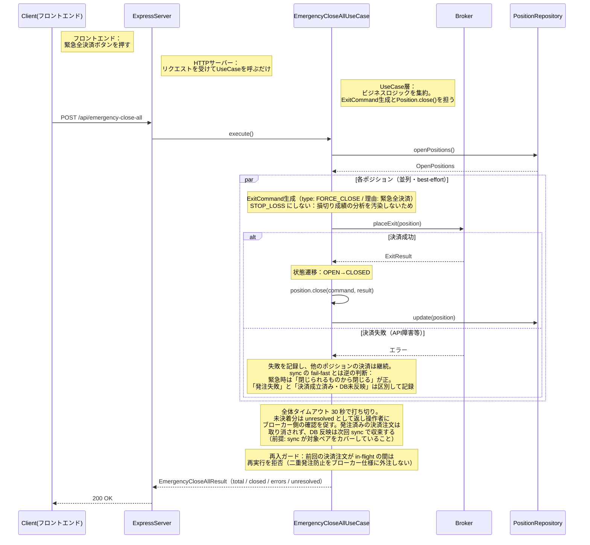
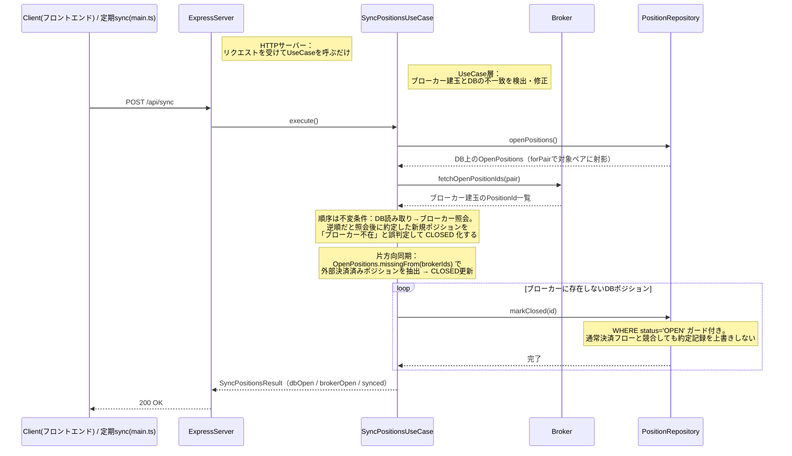

# シーケンス図: UseCase層による責務分離フロー

> ExpressServer が直接ドメインロジックを呼ばず、UseCase を経由する構造を描く。
> 増田亨レビューで指摘された依存方向違反（ExpressServer → GmoRestClient）の解消。

---

## 緊急全決済（実装済み: EmergencyCloseAllUseCase）

> 実装: `application/EmergencyCloseAllUseCase.ts`（Issue #52 Step 2）

## 建玉同期（実装済み: SyncPositionsUseCase）

> 実装: `application/SyncPositionsUseCase.ts`（Issue #52 Step 1）
> 呼び出し元は POST /api/sync（手動）と main.ts の定期 sync（1 分間隔）の 2 つ。同一の UseCase を共有する。

### 設計意図

- ExpressServerはリクエストを受けてUseCaseを呼ぶだけ。ビジネスロジックを一切持たない
- 増田亨レビューで指摘された依存方向違反を解消。ExpressServerがGmoRestClientを直接呼ぶ構造から、UseCase → Broker(Port) という正しい依存方向に修正
- UseCaseはBroker（Port interface）にだけ依存する。外部APIの存在を知らない

### 現実装の制約と改善項目

- CLOSED 更新は個別実行 + 失敗時 fail-fast（トランザクション一括ではない）。markClosed の失敗は DB 系統障害の可能性が高く、握り潰して続行すると障害を隠すため即座にエラー伝播する。未処理分は次回 sync（1 分間隔）の再試行で収束する
- 同期は片方向のみ（DB → CLOSED 更新）。ブローカーにあってDBにない建玉の登録、両方にある建玉の最新化は未実装（手動取引は管理対象外のため現状は仕様）
- `PositionRepository.markClosed(id)` はドメインの `Position.close()` を経由しないステータス更新。決済価格・損益（ExitResult）が取得できないための暫定措置で、ブローカーの約定履歴から ExitResult を復元してドメイン経由に変更するのが改善項目
